# Projects and dependencies analysis

This document provides a comprehensive overview of the projects and their dependencies in the context of upgrading to .NET 9.0.

## Table of Contents

- [Projects Relationship Graph](#projects-relationship-graph)
- [Project Details](#project-details)

  - [Admin.UnitTests\VttTools.Admin.UnitTests.csproj](#adminunittestsvtttoolsadminunittestscsproj)
  - [Admin\VttTools.Admin.csproj](#adminvtttoolsadmincsproj)
  - [AppHost\VttTools.AppHost.csproj](#apphostvtttoolsapphostcsproj)
  - [Assets.UnitTests\VttTools.Assets.UnitTests.csproj](#assetsunittestsvtttoolsassetsunittestscsproj)
  - [Assets\VttTools.Assets.csproj](#assetsvtttoolsassetscsproj)
  - [Auth.UnitTests\VttTools.Auth.UnitTests.csproj](#authunittestsvtttoolsauthunittestscsproj)
  - [Auth\VttTools.Auth.csproj](#authvtttoolsauthcsproj)
  - [Common.UnitTests\VttTools.Common.UnitTests.csproj](#commonunittestsvtttoolscommonunittestscsproj)
  - [Common\VttTools.Common.csproj](#commonvtttoolscommoncsproj)
  - [Core.UnitTests\VttTools.Core.UnitTests.csproj](#coreunittestsvtttoolscoreunittestscsproj)
  - [Core\VttTools.Core.csproj](#corevtttoolscorecsproj)
  - [Data.MigrationService\VttTools.Data.MigrationService.csproj](#datamigrationservicevtttoolsdatamigrationservicecsproj)
  - [Data.UnitTests\VttTools.Data.UnitTests.csproj](#dataunittestsvtttoolsdataunittestscsproj)
  - [Data\VttTools.Data.csproj](#datavtttoolsdatacsproj)
  - [Domain.UnitTests\VttTools.Domain.UnitTests.csproj](#domainunittestsvtttoolsdomainunittestscsproj)
  - [Domain\VttTools.Domain.csproj](#domainvtttoolsdomaincsproj)
  - [Game.UnitTests\VttTools.Game.UnitTests.csproj](#gameunittestsvtttoolsgameunittestscsproj)
  - [Game\VttTools.Game.csproj](#gamevtttoolsgamecsproj)
  - [Library.UnitTests\VttTools.Library.UnitTests.csproj](#libraryunittestsvtttoolslibraryunittestscsproj)
  - [Library\VttTools.Library.csproj](#libraryvtttoolslibrarycsproj)
  - [Media.UnitTests\VttTools.Media.UnitTests.csproj](#mediaunittestsvtttoolsmediaunittestscsproj)
  - [Media\VttTools.Media.csproj](#mediavtttoolsmediacsproj)
  - [WebAdminApp\VttTools.WebAdminApp.esproj](#webadminappvtttoolswebadminappesproj)
  - [WebClientApp\VttTools.WebClientApp.esproj](#webclientappvtttoolswebclientappesproj)
- [Aggregate NuGet packages details](#aggregate-nuget-packages-details)


## Projects Relationship Graph

Legend:
📦 SDK-style project
⚙️ Classic project


## Project Details

<a id="adminunittestsvtttoolsadminunittestscsproj"></a>
### Admin.UnitTests\VttTools.Admin.UnitTests.csproj

#### Project Info

- **Current Target Framework:** net10.0✅
- **SDK-style**: True
- **Project Kind:** DotNetCoreApp
- **Dependencies**: 4
- **Dependants**: 0
- **Number of Files**: 15
- **Lines of Code**: 3567

#### Dependency Graph

Legend:
📦 SDK-style project
⚙️ Classic project

```mermaid
flowchart TB
    subgraph current["VttTools.Admin.UnitTests.csproj"]
        MAIN["<b>📦&nbsp;VttTools.Admin.UnitTests.csproj</b><br/><small>net10.0</small>"]
        click MAIN "#adminunittestsvtttoolsadminunittestscsproj"
    end
    subgraph downstream["Dependencies (4"]
        P5["<b>📦&nbsp;VttTools.Data.csproj</b><br/><small>net10.0</small>"]
        P1["<b>📦&nbsp;VttTools.Common.csproj</b><br/><small>net10.0</small>"]
        P6["<b>📦&nbsp;VttTools.Admin.csproj</b><br/><small>net10.0</small>"]
        P3["<b>📦&nbsp;VttTools.Domain.csproj</b><br/><small>net10.0</small>"]
        click P5 "#datavtttoolsdatacsproj"
        click P1 "#commonvtttoolscommoncsproj"
        click P6 "#adminvtttoolsadmincsproj"
        click P3 "#domainvtttoolsdomaincsproj"
    end
    MAIN --> P5
    MAIN --> P1
    MAIN --> P6
    MAIN --> P3

```

#### Project Package References

| Package | Type | Current Version | Suggested Version | Description |
| :--- | :---: | :---: | :---: | :--- |
| AwesomeAssertions | Explicit | 9.3.0 |  | ✅Compatible |
| coverlet.collector | Explicit | 6.0.4 |  | ✅Compatible |
| coverlet.msbuild | Explicit | 6.0.4 |  | ✅Compatible |
| Microsoft.NET.Test.Sdk | Explicit | 18.0.1 |  | ✅Compatible |
| MockQueryable.NSubstitute | Explicit | 9.0.0 |  | ✅Compatible |
| NSubstitute | Explicit | 5.3.0 |  | ✅Compatible |
| xunit.runner.visualstudio | Explicit | 3.1.5 |  | ✅Compatible |
| xunit.v3 | Explicit | 3.2.0 |  | ✅Compatible |

<a id="adminvtttoolsadmincsproj"></a>
### Admin\VttTools.Admin.csproj

#### Project Info

- **Current Target Framework:** net10.0✅
- **SDK-style**: True
- **Project Kind:** AspNetCore
- **Dependencies**: 3
- **Dependants**: 2
- **Number of Files**: 27
- **Lines of Code**: 1969

#### Dependency Graph

Legend:
📦 SDK-style project
⚙️ Classic project

```mermaid
flowchart TB
    subgraph upstream["Dependants (2)"]
        P14["<b>📦&nbsp;VttTools.AppHost.csproj</b><br/><small>net10.0</small>"]
        P19["<b>📦&nbsp;VttTools.Admin.UnitTests.csproj</b><br/><small>net10.0</small>"]
        click P14 "#apphostvtttoolsapphostcsproj"
        click P19 "#adminunittestsvtttoolsadminunittestscsproj"
    end
    subgraph current["VttTools.Admin.csproj"]
        MAIN["<b>📦&nbsp;VttTools.Admin.csproj</b><br/><small>net10.0</small>"]
        click MAIN "#adminvtttoolsadmincsproj"
    end
    subgraph downstream["Dependencies (3"]
        P5["<b>📦&nbsp;VttTools.Data.csproj</b><br/><small>net10.0</small>"]
        P1["<b>📦&nbsp;VttTools.Common.csproj</b><br/><small>net10.0</small>"]
        P3["<b>📦&nbsp;VttTools.Domain.csproj</b><br/><small>net10.0</small>"]
        click P5 "#datavtttoolsdatacsproj"
        click P1 "#commonvtttoolscommoncsproj"
        click P3 "#domainvtttoolsdomaincsproj"
    end
    P14 --> MAIN
    P19 --> MAIN
    MAIN --> P5
    MAIN --> P1
    MAIN --> P3

```

#### Project Package References

| Package | Type | Current Version | Suggested Version | Description |
| :--- | :---: | :---: | :---: | :--- |
| Aspire.Microsoft.EntityFrameworkCore.SqlServer | Explicit | 13.0.0 |  | ✅Compatible |
| Microsoft.VisualStudio.Azure.Containers.Tools.Targets | Explicit | 1.22.1 |  | ✅Compatible |

<a id="apphostvtttoolsapphostcsproj"></a>
### AppHost\VttTools.AppHost.csproj

#### Project Info

- **Current Target Framework:** net10.0✅
- **SDK-style**: True
- **Project Kind:** DotNetCoreApp
- **Dependencies**: 7
- **Dependants**: 0
- **Number of Files**: 2
- **Lines of Code**: 106

#### Dependency Graph

Legend:
📦 SDK-style project
⚙️ Classic project

```mermaid
flowchart TB
    subgraph current["VttTools.AppHost.csproj"]
        MAIN["<b>📦&nbsp;VttTools.AppHost.csproj</b><br/><small>net10.0</small>"]
        click MAIN "#apphostvtttoolsapphostcsproj"
    end
    subgraph downstream["Dependencies (7"]
        P4["<b>📦&nbsp;VttTools.Data.MigrationService.csproj</b><br/><small>net10.0</small>"]
        P11["<b>📦&nbsp;VttTools.Media.csproj</b><br/><small>net10.0</small>"]
        P9["<b>📦&nbsp;VttTools.Game.csproj</b><br/><small>net10.0</small>"]
        P7["<b>📦&nbsp;VttTools.Assets.csproj</b><br/><small>net10.0</small>"]
        P10["<b>📦&nbsp;VttTools.Library.csproj</b><br/><small>net10.0</small>"]
        P8["<b>📦&nbsp;VttTools.Auth.csproj</b><br/><small>net10.0</small>"]
        P6["<b>📦&nbsp;VttTools.Admin.csproj</b><br/><small>net10.0</small>"]
        click P4 "#datamigrationservicevtttoolsdatamigrationservicecsproj"
        click P11 "#mediavtttoolsmediacsproj"
        click P9 "#gamevtttoolsgamecsproj"
        click P7 "#assetsvtttoolsassetscsproj"
        click P10 "#libraryvtttoolslibrarycsproj"
        click P8 "#authvtttoolsauthcsproj"
        click P6 "#adminvtttoolsadmincsproj"
    end
    MAIN --> P4
    MAIN --> P11
    MAIN --> P9
    MAIN --> P7
    MAIN --> P10
    MAIN --> P8
    MAIN --> P6

```

#### Project Package References

| Package | Type | Current Version | Suggested Version | Description |
| :--- | :---: | :---: | :---: | :--- |
| Aspire.Hosting.AppHost | Explicit | 13.0.0 |  | ✅Compatible |
| Aspire.Hosting.Azure.Storage | Explicit | 13.0.0 |  | ✅Compatible |
| Aspire.Hosting.NodeJs | Explicit | 9.5.2 |  | ✅Compatible |
| Aspire.Hosting.Redis | Explicit | 13.0.0 |  | ✅Compatible |
| Aspire.Hosting.SqlServer | Explicit | 13.0.0 |  | ✅Compatible |
| System.ServiceProcess.ServiceController | Explicit | 10.0.0 |  | ✅Compatible |

<a id="assetsunittestsvtttoolsassetsunittestscsproj"></a>
### Assets.UnitTests\VttTools.Assets.UnitTests.csproj

#### Project Info

- **Current Target Framework:** net10.0✅
- **SDK-style**: True
- **Project Kind:** DotNetCoreApp
- **Dependencies**: 1
- **Dependants**: 0
- **Number of Files**: 8
- **Lines of Code**: 344

#### Dependency Graph

Legend:
📦 SDK-style project
⚙️ Classic project

```mermaid
flowchart TB
    subgraph current["VttTools.Assets.UnitTests.csproj"]
        MAIN["<b>📦&nbsp;VttTools.Assets.UnitTests.csproj</b><br/><small>net10.0</small>"]
        click MAIN "#assetsunittestsvtttoolsassetsunittestscsproj"
    end
    subgraph downstream["Dependencies (1"]
        P7["<b>📦&nbsp;VttTools.Assets.csproj</b><br/><small>net10.0</small>"]
        click P7 "#assetsvtttoolsassetscsproj"
    end
    MAIN --> P7

```

#### Project Package References

| Package | Type | Current Version | Suggested Version | Description |
| :--- | :---: | :---: | :---: | :--- |
| AwesomeAssertions | Explicit | 9.3.0 |  | ✅Compatible |
| coverlet.collector | Explicit | 6.0.4 |  | ✅Compatible |
| coverlet.msbuild | Explicit | 6.0.4 |  | ✅Compatible |
| Microsoft.NET.Test.Sdk | Explicit | 18.0.1 |  | ✅Compatible |
| NSubstitute | Explicit | 5.3.0 |  | ✅Compatible |
| xunit.runner.visualstudio | Explicit | 3.1.5 |  | ✅Compatible |
| xunit.v3 | Explicit | 3.2.0 |  | ✅Compatible |

<a id="assetsvtttoolsassetscsproj"></a>
### Assets\VttTools.Assets.csproj

#### Project Info

- **Current Target Framework:** net10.0✅
- **SDK-style**: True
- **Project Kind:** AspNetCore
- **Dependencies**: 3
- **Dependants**: 2
- **Number of Files**: 57
- **Lines of Code**: 522

#### Dependency Graph

Legend:
📦 SDK-style project
⚙️ Classic project

```mermaid
flowchart TB
    subgraph upstream["Dependants (2)"]
        P14["<b>📦&nbsp;VttTools.AppHost.csproj</b><br/><small>net10.0</small>"]
        P20["<b>📦&nbsp;VttTools.Assets.UnitTests.csproj</b><br/><small>net10.0</small>"]
        click P14 "#apphostvtttoolsapphostcsproj"
        click P20 "#assetsunittestsvtttoolsassetsunittestscsproj"
    end
    subgraph current["VttTools.Assets.csproj"]
        MAIN["<b>📦&nbsp;VttTools.Assets.csproj</b><br/><small>net10.0</small>"]
        click MAIN "#assetsvtttoolsassetscsproj"
    end
    subgraph downstream["Dependencies (3"]
        P5["<b>📦&nbsp;VttTools.Data.csproj</b><br/><small>net10.0</small>"]
        P1["<b>📦&nbsp;VttTools.Common.csproj</b><br/><small>net10.0</small>"]
        P3["<b>📦&nbsp;VttTools.Domain.csproj</b><br/><small>net10.0</small>"]
        click P5 "#datavtttoolsdatacsproj"
        click P1 "#commonvtttoolscommoncsproj"
        click P3 "#domainvtttoolsdomaincsproj"
    end
    P14 --> MAIN
    P20 --> MAIN
    MAIN --> P5
    MAIN --> P1
    MAIN --> P3

```

#### Project Package References

| Package | Type | Current Version | Suggested Version | Description |
| :--- | :---: | :---: | :---: | :--- |
| Aspire.Microsoft.EntityFrameworkCore.SqlServer | Explicit | 13.0.0 |  | ✅Compatible |
| Microsoft.EntityFrameworkCore.Design | Explicit | 10.0.0 |  | ✅Compatible |
| Microsoft.Extensions.Azure | Explicit | 1.13.0 |  | ✅Compatible |
| Microsoft.VisualStudio.Azure.Containers.Tools.Targets | Explicit | 1.22.1 |  | ✅Compatible |

<a id="authunittestsvtttoolsauthunittestscsproj"></a>
### Auth.UnitTests\VttTools.Auth.UnitTests.csproj

#### Project Info

- **Current Target Framework:** net10.0✅
- **SDK-style**: True
- **Project Kind:** DotNetCoreApp
- **Dependencies**: 4
- **Dependants**: 0
- **Number of Files**: 12
- **Lines of Code**: 3269

#### Dependency Graph

Legend:
📦 SDK-style project
⚙️ Classic project

```mermaid
flowchart TB
    subgraph current["VttTools.Auth.UnitTests.csproj"]
        MAIN["<b>📦&nbsp;VttTools.Auth.UnitTests.csproj</b><br/><small>net10.0</small>"]
        click MAIN "#authunittestsvtttoolsauthunittestscsproj"
    end
    subgraph downstream["Dependencies (4"]
        P5["<b>📦&nbsp;VttTools.Data.csproj</b><br/><small>net10.0</small>"]
        P8["<b>📦&nbsp;VttTools.Auth.csproj</b><br/><small>net10.0</small>"]
        P1["<b>📦&nbsp;VttTools.Common.csproj</b><br/><small>net10.0</small>"]
        P3["<b>📦&nbsp;VttTools.Domain.csproj</b><br/><small>net10.0</small>"]
        click P5 "#datavtttoolsdatacsproj"
        click P8 "#authvtttoolsauthcsproj"
        click P1 "#commonvtttoolscommoncsproj"
        click P3 "#domainvtttoolsdomaincsproj"
    end
    MAIN --> P5
    MAIN --> P8
    MAIN --> P1
    MAIN --> P3

```

#### Project Package References

| Package | Type | Current Version | Suggested Version | Description |
| :--- | :---: | :---: | :---: | :--- |
| AwesomeAssertions | Explicit | 9.3.0 |  | ✅Compatible |
| coverlet.collector | Explicit | 6.0.4 |  | ✅Compatible |
| coverlet.msbuild | Explicit | 6.0.4 |  | ✅Compatible |
| Microsoft.NET.Test.Sdk | Explicit | 18.0.1 |  | ✅Compatible |
| NSubstitute | Explicit | 5.3.0 |  | ✅Compatible |
| xunit.runner.visualstudio | Explicit | 3.1.5 |  | ✅Compatible |
| xunit.v3 | Explicit | 3.2.0 |  | ✅Compatible |

<a id="authvtttoolsauthcsproj"></a>
### Auth\VttTools.Auth.csproj

#### Project Info

- **Current Target Framework:** net10.0✅
- **SDK-style**: True
- **Project Kind:** AspNetCore
- **Dependencies**: 3
- **Dependants**: 2
- **Number of Files**: 29
- **Lines of Code**: 1718

#### Dependency Graph

Legend:
📦 SDK-style project
⚙️ Classic project

```mermaid
flowchart TB
    subgraph upstream["Dependants (2)"]
        P14["<b>📦&nbsp;VttTools.AppHost.csproj</b><br/><small>net10.0</small>"]
        P21["<b>📦&nbsp;VttTools.Auth.UnitTests.csproj</b><br/><small>net10.0</small>"]
        click P14 "#apphostvtttoolsapphostcsproj"
        click P21 "#authunittestsvtttoolsauthunittestscsproj"
    end
    subgraph current["VttTools.Auth.csproj"]
        MAIN["<b>📦&nbsp;VttTools.Auth.csproj</b><br/><small>net10.0</small>"]
        click MAIN "#authvtttoolsauthcsproj"
    end
    subgraph downstream["Dependencies (3"]
        P5["<b>📦&nbsp;VttTools.Data.csproj</b><br/><small>net10.0</small>"]
        P1["<b>📦&nbsp;VttTools.Common.csproj</b><br/><small>net10.0</small>"]
        P3["<b>📦&nbsp;VttTools.Domain.csproj</b><br/><small>net10.0</small>"]
        click P5 "#datavtttoolsdatacsproj"
        click P1 "#commonvtttoolscommoncsproj"
        click P3 "#domainvtttoolsdomaincsproj"
    end
    P14 --> MAIN
    P21 --> MAIN
    MAIN --> P5
    MAIN --> P1
    MAIN --> P3

```

#### Project Package References

| Package | Type | Current Version | Suggested Version | Description |
| :--- | :---: | :---: | :---: | :--- |
| Aspire.Microsoft.EntityFrameworkCore.SqlServer | Explicit | 13.0.0 |  | ✅Compatible |
| Microsoft.AspNetCore.Authentication.JwtBearer | Explicit | 10.0.0 |  | ✅Compatible |
| Microsoft.VisualStudio.Azure.Containers.Tools.Targets | Explicit | 1.22.1 |  | ✅Compatible |
| System.IdentityModel.Tokens.Jwt | Explicit | 8.14.0 |  | ✅Compatible |

<a id="commonunittestsvtttoolscommonunittestscsproj"></a>
### Common.UnitTests\VttTools.Common.UnitTests.csproj

#### Project Info

- **Current Target Framework:** net10.0✅
- **SDK-style**: True
- **Project Kind:** DotNetCoreApp
- **Dependencies**: 1
- **Dependants**: 0
- **Number of Files**: 17
- **Lines of Code**: 2651

#### Dependency Graph

Legend:
📦 SDK-style project
⚙️ Classic project

```mermaid
flowchart TB
    subgraph current["VttTools.Common.UnitTests.csproj"]
        MAIN["<b>📦&nbsp;VttTools.Common.UnitTests.csproj</b><br/><small>net10.0</small>"]
        click MAIN "#commonunittestsvtttoolscommonunittestscsproj"
    end
    subgraph downstream["Dependencies (1"]
        P1["<b>📦&nbsp;VttTools.Common.csproj</b><br/><small>net10.0</small>"]
        click P1 "#commonvtttoolscommoncsproj"
    end
    MAIN --> P1

```

#### Project Package References

| Package | Type | Current Version | Suggested Version | Description |
| :--- | :---: | :---: | :---: | :--- |
| AwesomeAssertions | Explicit | 9.3.0 |  | ✅Compatible |
| coverlet.collector | Explicit | 6.0.4 |  | ✅Compatible |
| coverlet.msbuild | Explicit | 6.0.4 |  | ✅Compatible |
| Microsoft.NET.Test.Sdk | Explicit | 18.0.1 |  | ✅Compatible |
| NSubstitute | Explicit | 5.3.0 |  | ✅Compatible |
| xunit.runner.visualstudio | Explicit | 3.1.5 |  | ✅Compatible |
| xunit.v3 | Explicit | 3.2.0 |  | ✅Compatible |

<a id="commonvtttoolscommoncsproj"></a>
### Common\VttTools.Common.csproj

#### Project Info

- **Current Target Framework:** net10.0✅
- **SDK-style**: True
- **Project Kind:** ClassLibrary
- **Dependencies**: 1
- **Dependants**: 9
- **Number of Files**: 28
- **Lines of Code**: 1735

#### Dependency Graph

Legend:
📦 SDK-style project
⚙️ Classic project

```mermaid
flowchart TB
    subgraph upstream["Dependants (9)"]
        P6["<b>📦&nbsp;VttTools.Admin.csproj</b><br/><small>net10.0</small>"]
        P7["<b>📦&nbsp;VttTools.Assets.csproj</b><br/><small>net10.0</small>"]
        P8["<b>📦&nbsp;VttTools.Auth.csproj</b><br/><small>net10.0</small>"]
        P9["<b>📦&nbsp;VttTools.Game.csproj</b><br/><small>net10.0</small>"]
        P10["<b>📦&nbsp;VttTools.Library.csproj</b><br/><small>net10.0</small>"]
        P11["<b>📦&nbsp;VttTools.Media.csproj</b><br/><small>net10.0</small>"]
        P15["<b>📦&nbsp;VttTools.Common.UnitTests.csproj</b><br/><small>net10.0</small>"]
        P19["<b>📦&nbsp;VttTools.Admin.UnitTests.csproj</b><br/><small>net10.0</small>"]
        P21["<b>📦&nbsp;VttTools.Auth.UnitTests.csproj</b><br/><small>net10.0</small>"]
        click P6 "#adminvtttoolsadmincsproj"
        click P7 "#assetsvtttoolsassetscsproj"
        click P8 "#authvtttoolsauthcsproj"
        click P9 "#gamevtttoolsgamecsproj"
        click P10 "#libraryvtttoolslibrarycsproj"
        click P11 "#mediavtttoolsmediacsproj"
        click P15 "#commonunittestsvtttoolscommonunittestscsproj"
        click P19 "#adminunittestsvtttoolsadminunittestscsproj"
        click P21 "#authunittestsvtttoolsauthunittestscsproj"
    end
    subgraph current["VttTools.Common.csproj"]
        MAIN["<b>📦&nbsp;VttTools.Common.csproj</b><br/><small>net10.0</small>"]
        click MAIN "#commonvtttoolscommoncsproj"
    end
    subgraph downstream["Dependencies (1"]
        P3["<b>📦&nbsp;VttTools.Domain.csproj</b><br/><small>net10.0</small>"]
        click P3 "#domainvtttoolsdomaincsproj"
    end
    P6 --> MAIN
    P7 --> MAIN
    P8 --> MAIN
    P9 --> MAIN
    P10 --> MAIN
    P11 --> MAIN
    P15 --> MAIN
    P19 --> MAIN
    P21 --> MAIN
    MAIN --> P3

```

#### Project Package References

| Package | Type | Current Version | Suggested Version | Description |
| :--- | :---: | :---: | :---: | :--- |
| Azure.Storage.Blobs | Explicit | 12.26.0 |  | ✅Compatible |
| FFMpegCore | Explicit | 5.4.0 |  | ✅Compatible |
| Microsoft.AspNetCore.Authentication.JwtBearer | Explicit | 10.0.0 |  | ✅Compatible |
| Microsoft.AspNetCore.OpenApi | Explicit | 10.0.0 |  | ✅Compatible |
| Microsoft.Data.SqlClient | Explicit | 6.1.3 |  | ✅Compatible |
| Microsoft.Extensions.Http.Resilience | Explicit | 10.0.0 |  | ✅Compatible |
| Microsoft.Extensions.ServiceDiscovery | Explicit | 10.0.0 |  | ✅Compatible |
| SixLabors.ImageSharp | Explicit | 3.1.12 |  | ✅Compatible |

<a id="coreunittestsvtttoolscoreunittestscsproj"></a>
### Core.UnitTests\VttTools.Core.UnitTests.csproj

#### Project Info

- **Current Target Framework:** net10.0✅
- **SDK-style**: True
- **Project Kind:** DotNetCoreApp
- **Dependencies**: 1
- **Dependants**: 0
- **Number of Files**: 8
- **Lines of Code**: 499

#### Dependency Graph

Legend:
📦 SDK-style project
⚙️ Classic project

```mermaid
flowchart TB
    subgraph current["VttTools.Core.UnitTests.csproj"]
        MAIN["<b>📦&nbsp;VttTools.Core.UnitTests.csproj</b><br/><small>net10.0</small>"]
        click MAIN "#coreunittestsvtttoolscoreunittestscsproj"
    end
    subgraph downstream["Dependencies (1"]
        P2["<b>📦&nbsp;VttTools.Core.csproj</b><br/><small>net10.0</small>"]
        click P2 "#corevtttoolscorecsproj"
    end
    MAIN --> P2

```

#### Project Package References

| Package | Type | Current Version | Suggested Version | Description |
| :--- | :---: | :---: | :---: | :--- |
| AwesomeAssertions | Explicit | 9.3.0 |  | ✅Compatible |
| coverlet.collector | Explicit | 6.0.4 |  | ✅Compatible |
| coverlet.msbuild | Explicit | 6.0.4 |  | ✅Compatible |
| Microsoft.NET.Test.Sdk | Explicit | 18.0.1 |  | ✅Compatible |
| NSubstitute | Explicit | 5.3.0 |  | ✅Compatible |
| xunit.runner.visualstudio | Explicit | 3.1.5 |  | ✅Compatible |
| xunit.v3 | Explicit | 3.2.0 |  | ✅Compatible |

<a id="corevtttoolscorecsproj"></a>
### Core\VttTools.Core.csproj

#### Project Info

- **Current Target Framework:** net10.0✅
- **SDK-style**: True
- **Project Kind:** ClassLibrary
- **Dependencies**: 0
- **Dependants**: 2
- **Number of Files**: 6
- **Lines of Code**: 188

#### Dependency Graph

Legend:
📦 SDK-style project
⚙️ Classic project


#### Project Package References

| Package | Type | Current Version | Suggested Version | Description |
| :--- | :---: | :---: | :---: | :--- |
| DotNetToolbox.Core | Explicit | 9.0.1 |  | ✅Compatible |

<a id="datamigrationservicevtttoolsdatamigrationservicecsproj"></a>
### Data.MigrationService\VttTools.Data.MigrationService.csproj

#### Project Info

- **Current Target Framework:** net10.0✅
- **SDK-style**: True
- **Project Kind:** DotNetCoreApp
- **Dependencies**: 1
- **Dependants**: 1
- **Number of Files**: 59
- **Lines of Code**: 7882

#### Dependency Graph

Legend:
📦 SDK-style project
⚙️ Classic project

```mermaid
flowchart TB
    subgraph upstream["Dependants (1)"]
        P14["<b>📦&nbsp;VttTools.AppHost.csproj</b><br/><small>net10.0</small>"]
        click P14 "#apphostvtttoolsapphostcsproj"
    end
    subgraph current["VttTools.Data.MigrationService.csproj"]
        MAIN["<b>📦&nbsp;VttTools.Data.MigrationService.csproj</b><br/><small>net10.0</small>"]
        click MAIN "#datamigrationservicevtttoolsdatamigrationservicecsproj"
    end
    subgraph downstream["Dependencies (1"]
        P5["<b>📦&nbsp;VttTools.Data.csproj</b><br/><small>net10.0</small>"]
        click P5 "#datavtttoolsdatacsproj"
    end
    P14 --> MAIN
    MAIN --> P5

```

#### Project Package References

| Package | Type | Current Version | Suggested Version | Description |
| :--- | :---: | :---: | :---: | :--- |
| Aspire.Microsoft.EntityFrameworkCore.SqlServer | Explicit | 13.0.0 |  | ✅Compatible |
| Microsoft.EntityFrameworkCore.Design | Explicit | 10.0.0 |  | ✅Compatible |
| Microsoft.EntityFrameworkCore.Tools | Explicit | 10.0.0 |  | ✅Compatible |
| Microsoft.Extensions.Configuration.Json | Explicit | 10.0.0 |  | ✅Compatible |
| Microsoft.Extensions.Configuration.UserSecrets | Explicit | 10.0.0 |  | ✅Compatible |
| Microsoft.Extensions.Hosting | Explicit | 10.0.0 |  | ✅Compatible |

<a id="dataunittestsvtttoolsdataunittestscsproj"></a>
### Data.UnitTests\VttTools.Data.UnitTests.csproj

#### Project Info

- **Current Target Framework:** net10.0✅
- **SDK-style**: True
- **Project Kind:** DotNetCoreApp
- **Dependencies**: 1
- **Dependants**: 0
- **Number of Files**: 12
- **Lines of Code**: 1094

#### Dependency Graph

Legend:
📦 SDK-style project
⚙️ Classic project

```mermaid
flowchart TB
    subgraph current["VttTools.Data.UnitTests.csproj"]
        MAIN["<b>📦&nbsp;VttTools.Data.UnitTests.csproj</b><br/><small>net10.0</small>"]
        click MAIN "#dataunittestsvtttoolsdataunittestscsproj"
    end
    subgraph downstream["Dependencies (1"]
        P5["<b>📦&nbsp;VttTools.Data.csproj</b><br/><small>net10.0</small>"]
        click P5 "#datavtttoolsdatacsproj"
    end
    MAIN --> P5

```

#### Project Package References

| Package | Type | Current Version | Suggested Version | Description |
| :--- | :---: | :---: | :---: | :--- |
| AwesomeAssertions | Explicit | 9.3.0 |  | ✅Compatible |
| coverlet.collector | Explicit | 6.0.4 |  | ✅Compatible |
| coverlet.msbuild | Explicit | 6.0.4 |  | ✅Compatible |
| Microsoft.EntityFrameworkCore.InMemory | Explicit | 10.0.0 |  | ✅Compatible |
| Microsoft.NET.Test.Sdk | Explicit | 18.0.1 |  | ✅Compatible |
| NSubstitute | Explicit | 5.3.0 |  | ✅Compatible |
| xunit.runner.visualstudio | Explicit | 3.1.5 |  | ✅Compatible |
| xunit.v3 | Explicit | 3.2.0 |  | ✅Compatible |

<a id="datavtttoolsdatacsproj"></a>
### Data\VttTools.Data.csproj

#### Project Info

- **Current Target Framework:** net10.0✅
- **SDK-style**: True
- **Project Kind:** ClassLibrary
- **Dependencies**: 1
- **Dependants**: 10
- **Number of Files**: 107
- **Lines of Code**: 3579

#### Dependency Graph

Legend:
📦 SDK-style project
⚙️ Classic project

```mermaid
flowchart TB
    subgraph upstream["Dependants (10)"]
        P4["<b>📦&nbsp;VttTools.Data.MigrationService.csproj</b><br/><small>net10.0</small>"]
        P6["<b>📦&nbsp;VttTools.Admin.csproj</b><br/><small>net10.0</small>"]
        P7["<b>📦&nbsp;VttTools.Assets.csproj</b><br/><small>net10.0</small>"]
        P8["<b>📦&nbsp;VttTools.Auth.csproj</b><br/><small>net10.0</small>"]
        P9["<b>📦&nbsp;VttTools.Game.csproj</b><br/><small>net10.0</small>"]
        P10["<b>📦&nbsp;VttTools.Library.csproj</b><br/><small>net10.0</small>"]
        P11["<b>📦&nbsp;VttTools.Media.csproj</b><br/><small>net10.0</small>"]
        P18["<b>📦&nbsp;VttTools.Data.UnitTests.csproj</b><br/><small>net10.0</small>"]
        P19["<b>📦&nbsp;VttTools.Admin.UnitTests.csproj</b><br/><small>net10.0</small>"]
        P21["<b>📦&nbsp;VttTools.Auth.UnitTests.csproj</b><br/><small>net10.0</small>"]
        click P4 "#datamigrationservicevtttoolsdatamigrationservicecsproj"
        click P6 "#adminvtttoolsadmincsproj"
        click P7 "#assetsvtttoolsassetscsproj"
        click P8 "#authvtttoolsauthcsproj"
        click P9 "#gamevtttoolsgamecsproj"
        click P10 "#libraryvtttoolslibrarycsproj"
        click P11 "#mediavtttoolsmediacsproj"
        click P18 "#dataunittestsvtttoolsdataunittestscsproj"
        click P19 "#adminunittestsvtttoolsadminunittestscsproj"
        click P21 "#authunittestsvtttoolsauthunittestscsproj"
    end
    subgraph current["VttTools.Data.csproj"]
        MAIN["<b>📦&nbsp;VttTools.Data.csproj</b><br/><small>net10.0</small>"]
        click MAIN "#datavtttoolsdatacsproj"
    end
    subgraph downstream["Dependencies (1"]
        P3["<b>📦&nbsp;VttTools.Domain.csproj</b><br/><small>net10.0</small>"]
        click P3 "#domainvtttoolsdomaincsproj"
    end
    P4 --> MAIN
    P6 --> MAIN
    P7 --> MAIN
    P8 --> MAIN
    P9 --> MAIN
    P10 --> MAIN
    P11 --> MAIN
    P18 --> MAIN
    P19 --> MAIN
    P21 --> MAIN
    MAIN --> P3

```

#### Project Package References

| Package | Type | Current Version | Suggested Version | Description |
| :--- | :---: | :---: | :---: | :--- |
| Microsoft.EntityFrameworkCore.Design | Explicit | 10.0.0 |  | ✅Compatible |
| Microsoft.EntityFrameworkCore.SqlServer | Explicit | 10.0.0 |  | ✅Compatible |
| Microsoft.Extensions.Configuration.Json | Explicit | 10.0.0 |  | ✅Compatible |
| Microsoft.Extensions.Configuration.UserSecrets | Explicit | 10.0.0 |  | ✅Compatible |
| Microsoft.Extensions.Hosting.Abstractions | Explicit | 10.0.0 |  | ✅Compatible |

<a id="domainunittestsvtttoolsdomainunittestscsproj"></a>
### Domain.UnitTests\VttTools.Domain.UnitTests.csproj

#### Project Info

- **Current Target Framework:** net10.0✅
- **SDK-style**: True
- **Project Kind:** DotNetCoreApp
- **Dependencies**: 1
- **Dependants**: 0
- **Number of Files**: 43
- **Lines of Code**: 1907

#### Dependency Graph

Legend:
📦 SDK-style project
⚙️ Classic project

```mermaid
flowchart TB
    subgraph current["VttTools.Domain.UnitTests.csproj"]
        MAIN["<b>📦&nbsp;VttTools.Domain.UnitTests.csproj</b><br/><small>net10.0</small>"]
        click MAIN "#domainunittestsvtttoolsdomainunittestscsproj"
    end
    subgraph downstream["Dependencies (1"]
        P3["<b>📦&nbsp;VttTools.Domain.csproj</b><br/><small>net10.0</small>"]
        click P3 "#domainvtttoolsdomaincsproj"
    end
    MAIN --> P3

```

#### Project Package References

| Package | Type | Current Version | Suggested Version | Description |
| :--- | :---: | :---: | :---: | :--- |
| AwesomeAssertions | Explicit | 9.3.0 |  | ✅Compatible |
| coverlet.collector | Explicit | 6.0.4 |  | ✅Compatible |
| coverlet.msbuild | Explicit | 6.0.4 |  | ✅Compatible |
| Microsoft.NET.Test.Sdk | Explicit | 18.0.1 |  | ✅Compatible |
| NSubstitute | Explicit | 5.3.0 |  | ✅Compatible |
| xunit.runner.visualstudio | Explicit | 3.1.5 |  | ✅Compatible |
| xunit.v3 | Explicit | 3.2.0 |  | ✅Compatible |

<a id="domainvtttoolsdomaincsproj"></a>
### Domain\VttTools.Domain.csproj

#### Project Info

- **Current Target Framework:** net10.0✅
- **SDK-style**: True
- **Project Kind:** ClassLibrary
- **Dependencies**: 1
- **Dependants**: 11
- **Number of Files**: 223
- **Lines of Code**: 4281

#### Dependency Graph

Legend:
📦 SDK-style project
⚙️ Classic project

```mermaid
flowchart TB
    subgraph upstream["Dependants (11)"]
        P1["<b>📦&nbsp;VttTools.Common.csproj</b><br/><small>net10.0</small>"]
        P5["<b>📦&nbsp;VttTools.Data.csproj</b><br/><small>net10.0</small>"]
        P6["<b>📦&nbsp;VttTools.Admin.csproj</b><br/><small>net10.0</small>"]
        P7["<b>📦&nbsp;VttTools.Assets.csproj</b><br/><small>net10.0</small>"]
        P8["<b>📦&nbsp;VttTools.Auth.csproj</b><br/><small>net10.0</small>"]
        P9["<b>📦&nbsp;VttTools.Game.csproj</b><br/><small>net10.0</small>"]
        P10["<b>📦&nbsp;VttTools.Library.csproj</b><br/><small>net10.0</small>"]
        P11["<b>📦&nbsp;VttTools.Media.csproj</b><br/><small>net10.0</small>"]
        P17["<b>📦&nbsp;VttTools.Domain.UnitTests.csproj</b><br/><small>net10.0</small>"]
        P19["<b>📦&nbsp;VttTools.Admin.UnitTests.csproj</b><br/><small>net10.0</small>"]
        P21["<b>📦&nbsp;VttTools.Auth.UnitTests.csproj</b><br/><small>net10.0</small>"]
        click P1 "#commonvtttoolscommoncsproj"
        click P5 "#datavtttoolsdatacsproj"
        click P6 "#adminvtttoolsadmincsproj"
        click P7 "#assetsvtttoolsassetscsproj"
        click P8 "#authvtttoolsauthcsproj"
        click P9 "#gamevtttoolsgamecsproj"
        click P10 "#libraryvtttoolslibrarycsproj"
        click P11 "#mediavtttoolsmediacsproj"
        click P17 "#domainunittestsvtttoolsdomainunittestscsproj"
        click P19 "#adminunittestsvtttoolsadminunittestscsproj"
        click P21 "#authunittestsvtttoolsauthunittestscsproj"
    end
    subgraph current["VttTools.Domain.csproj"]
        MAIN["<b>📦&nbsp;VttTools.Domain.csproj</b><br/><small>net10.0</small>"]
        click MAIN "#domainvtttoolsdomaincsproj"
    end
    subgraph downstream["Dependencies (1"]
        P2["<b>📦&nbsp;VttTools.Core.csproj</b><br/><small>net10.0</small>"]
        click P2 "#corevtttoolscorecsproj"
    end
    P1 --> MAIN
    P5 --> MAIN
    P6 --> MAIN
    P7 --> MAIN
    P8 --> MAIN
    P9 --> MAIN
    P10 --> MAIN
    P11 --> MAIN
    P17 --> MAIN
    P19 --> MAIN
    P21 --> MAIN
    MAIN --> P2

```

#### Project Package References

| Package | Type | Current Version | Suggested Version | Description |
| :--- | :---: | :---: | :---: | :--- |
| DotNetToolbox.Core | Explicit | 9.0.1 |  | ✅Compatible |
| Microsoft.AspNetCore.Identity.EntityFrameworkCore | Explicit | 10.0.0 |  | ✅Compatible |

<a id="gameunittestsvtttoolsgameunittestscsproj"></a>
### Game.UnitTests\VttTools.Game.UnitTests.csproj

#### Project Info

- **Current Target Framework:** net10.0✅
- **SDK-style**: True
- **Project Kind:** DotNetCoreApp
- **Dependencies**: 1
- **Dependants**: 0
- **Number of Files**: 9
- **Lines of Code**: 1124

#### Dependency Graph

Legend:
📦 SDK-style project
⚙️ Classic project


#### Project Package References

| Package | Type | Current Version | Suggested Version | Description |
| :--- | :---: | :---: | :---: | :--- |
| AwesomeAssertions | Explicit | 9.3.0 |  | ✅Compatible |
| coverlet.collector | Explicit | 6.0.4 |  | ✅Compatible |
| coverlet.msbuild | Explicit | 6.0.4 |  | ✅Compatible |
| Microsoft.NET.Test.Sdk | Explicit | 18.0.1 |  | ✅Compatible |
| NSubstitute | Explicit | 5.3.0 |  | ✅Compatible |
| xunit.runner.visualstudio | Explicit | 3.1.5 |  | ✅Compatible |
| xunit.v3 | Explicit | 3.2.0 |  | ✅Compatible |

<a id="gamevtttoolsgamecsproj"></a>
### Game\VttTools.Game.csproj

#### Project Info

- **Current Target Framework:** net10.0✅
- **SDK-style**: True
- **Project Kind:** AspNetCore
- **Dependencies**: 3
- **Dependants**: 2
- **Number of Files**: 10
- **Lines of Code**: 402

#### Dependency Graph

Legend:
📦 SDK-style project
⚙️ Classic project


#### Project Package References

| Package | Type | Current Version | Suggested Version | Description |
| :--- | :---: | :---: | :---: | :--- |
| Aspire.Azure.Storage.Blobs | Explicit | 13.0.0 |  | ✅Compatible |
| Aspire.Microsoft.EntityFrameworkCore.SqlServer | Explicit | 13.0.0 |  | ✅Compatible |
| Microsoft.Extensions.Azure | Explicit | 1.13.0 |  | ✅Compatible |
| Microsoft.VisualStudio.Azure.Containers.Tools.Targets | Explicit | 1.22.1 |  | ✅Compatible |

<a id="libraryunittestsvtttoolslibraryunittestscsproj"></a>
### Library.UnitTests\VttTools.Library.UnitTests.csproj

#### Project Info

- **Current Target Framework:** net10.0✅
- **SDK-style**: True
- **Project Kind:** DotNetCoreApp
- **Dependencies**: 1
- **Dependants**: 0
- **Number of Files**: 18
- **Lines of Code**: 4818

#### Dependency Graph

Legend:
📦 SDK-style project
⚙️ Classic project

```mermaid
flowchart TB
    subgraph current["VttTools.Library.UnitTests.csproj"]
        MAIN["<b>📦&nbsp;VttTools.Library.UnitTests.csproj</b><br/><small>net10.0</small>"]
        click MAIN "#libraryunittestsvtttoolslibraryunittestscsproj"
    end
    subgraph downstream["Dependencies (1"]
        P10["<b>📦&nbsp;VttTools.Library.csproj</b><br/><small>net10.0</small>"]
        click P10 "#libraryvtttoolslibrarycsproj"
    end
    MAIN --> P10

```

#### Project Package References

| Package | Type | Current Version | Suggested Version | Description |
| :--- | :---: | :---: | :---: | :--- |
| AwesomeAssertions | Explicit | 9.3.0 |  | ✅Compatible |
| coverlet.collector | Explicit | 6.0.4 |  | ✅Compatible |
| coverlet.msbuild | Explicit | 6.0.4 |  | ✅Compatible |
| Microsoft.EntityFrameworkCore.InMemory | Explicit | 10.0.0 |  | ✅Compatible |
| Microsoft.EntityFrameworkCore.SqlServer | Explicit | 10.0.0 |  | ✅Compatible |
| Microsoft.NET.Test.Sdk | Explicit | 18.0.1 |  | ✅Compatible |
| NSubstitute | Explicit | 5.3.0 |  | ✅Compatible |
| xunit.runner.visualstudio | Explicit | 3.1.5 |  | ✅Compatible |
| xunit.v3 | Explicit | 3.2.0 |  | ✅Compatible |

<a id="libraryvtttoolslibrarycsproj"></a>
### Library\VttTools.Library.csproj

#### Project Info

- **Current Target Framework:** net10.0✅
- **SDK-style**: True
- **Project Kind:** AspNetCore
- **Dependencies**: 3
- **Dependants**: 2
- **Number of Files**: 24
- **Lines of Code**: 2658

#### Dependency Graph

Legend:
📦 SDK-style project
⚙️ Classic project

```mermaid
flowchart TB
    subgraph upstream["Dependants (2)"]
        P14["<b>📦&nbsp;VttTools.AppHost.csproj</b><br/><small>net10.0</small>"]
        P23["<b>📦&nbsp;VttTools.Library.UnitTests.csproj</b><br/><small>net10.0</small>"]
        click P14 "#apphostvtttoolsapphostcsproj"
        click P23 "#libraryunittestsvtttoolslibraryunittestscsproj"
    end
    subgraph current["VttTools.Library.csproj"]
        MAIN["<b>📦&nbsp;VttTools.Library.csproj</b><br/><small>net10.0</small>"]
        click MAIN "#libraryvtttoolslibrarycsproj"
    end
    subgraph downstream["Dependencies (3"]
        P5["<b>📦&nbsp;VttTools.Data.csproj</b><br/><small>net10.0</small>"]
        P1["<b>📦&nbsp;VttTools.Common.csproj</b><br/><small>net10.0</small>"]
        P3["<b>📦&nbsp;VttTools.Domain.csproj</b><br/><small>net10.0</small>"]
        click P5 "#datavtttoolsdatacsproj"
        click P1 "#commonvtttoolscommoncsproj"
        click P3 "#domainvtttoolsdomaincsproj"
    end
    P14 --> MAIN
    P23 --> MAIN
    MAIN --> P5
    MAIN --> P1
    MAIN --> P3

```

#### Project Package References

| Package | Type | Current Version | Suggested Version | Description |
| :--- | :---: | :---: | :---: | :--- |
| Aspire.Azure.Storage.Blobs | Explicit | 13.0.0 |  | ✅Compatible |
| Aspire.Microsoft.EntityFrameworkCore.SqlServer | Explicit | 13.0.0 |  | ✅Compatible |
| Microsoft.Extensions.Azure | Explicit | 1.13.0 |  | ✅Compatible |
| Microsoft.VisualStudio.Azure.Containers.Tools.Targets | Explicit | 1.22.1 |  | ✅Compatible |

<a id="mediaunittestsvtttoolsmediaunittestscsproj"></a>
### Media.UnitTests\VttTools.Media.UnitTests.csproj

#### Project Info

- **Current Target Framework:** net10.0✅
- **SDK-style**: True
- **Project Kind:** DotNetCoreApp
- **Dependencies**: 1
- **Dependants**: 0
- **Number of Files**: 7
- **Lines of Code**: 180

#### Dependency Graph

Legend:
📦 SDK-style project
⚙️ Classic project

```mermaid
flowchart TB
    subgraph current["VttTools.Media.UnitTests.csproj"]
        MAIN["<b>📦&nbsp;VttTools.Media.UnitTests.csproj</b><br/><small>net10.0</small>"]
        click MAIN "#mediaunittestsvtttoolsmediaunittestscsproj"
    end
    subgraph downstream["Dependencies (1"]
        P11["<b>📦&nbsp;VttTools.Media.csproj</b><br/><small>net10.0</small>"]
        click P11 "#mediavtttoolsmediacsproj"
    end
    MAIN --> P11

```

#### Project Package References

| Package | Type | Current Version | Suggested Version | Description |
| :--- | :---: | :---: | :---: | :--- |
| AwesomeAssertions | Explicit | 9.3.0 |  | ✅Compatible |
| coverlet.collector | Explicit | 6.0.4 |  | ✅Compatible |
| coverlet.msbuild | Explicit | 6.0.4 |  | ✅Compatible |
| Microsoft.EntityFrameworkCore.InMemory | Explicit | 10.0.0 |  | ✅Compatible |
| Microsoft.NET.Test.Sdk | Explicit | 18.0.1 |  | ✅Compatible |
| NSubstitute | Explicit | 5.3.0 |  | ✅Compatible |
| xunit.runner.visualstudio | Explicit | 3.1.5 |  | ✅Compatible |
| xunit.v3 | Explicit | 3.2.0 |  | ✅Compatible |

<a id="mediavtttoolsmediacsproj"></a>
### Media\VttTools.Media.csproj

#### Project Info

- **Current Target Framework:** net10.0✅
- **SDK-style**: True
- **Project Kind:** AspNetCore
- **Dependencies**: 3
- **Dependants**: 2
- **Number of Files**: 12
- **Lines of Code**: 507

#### Dependency Graph

Legend:
📦 SDK-style project
⚙️ Classic project

```mermaid
flowchart TB
    subgraph upstream["Dependants (2)"]
        P14["<b>📦&nbsp;VttTools.AppHost.csproj</b><br/><small>net10.0</small>"]
        P24["<b>📦&nbsp;VttTools.Media.UnitTests.csproj</b><br/><small>net10.0</small>"]
        click P14 "#apphostvtttoolsapphostcsproj"
        click P24 "#mediaunittestsvtttoolsmediaunittestscsproj"
    end
    subgraph current["VttTools.Media.csproj"]
        MAIN["<b>📦&nbsp;VttTools.Media.csproj</b><br/><small>net10.0</small>"]
        click MAIN "#mediavtttoolsmediacsproj"
    end
    subgraph downstream["Dependencies (3"]
        P5["<b>📦&nbsp;VttTools.Data.csproj</b><br/><small>net10.0</small>"]
        P1["<b>📦&nbsp;VttTools.Common.csproj</b><br/><small>net10.0</small>"]
        P3["<b>📦&nbsp;VttTools.Domain.csproj</b><br/><small>net10.0</small>"]
        click P5 "#datavtttoolsdatacsproj"
        click P1 "#commonvtttoolscommoncsproj"
        click P3 "#domainvtttoolsdomaincsproj"
    end
    P14 --> MAIN
    P24 --> MAIN
    MAIN --> P5
    MAIN --> P1
    MAIN --> P3

```

#### Project Package References

| Package | Type | Current Version | Suggested Version | Description |
| :--- | :---: | :---: | :---: | :--- |
| Aspire.Azure.Storage.Blobs | Explicit | 13.0.0 |  | ✅Compatible |
| Aspire.Microsoft.EntityFrameworkCore.SqlServer | Explicit | 13.0.0 |  | ✅Compatible |
| Azure.Storage.Blobs | Explicit | 12.26.0 |  | ✅Compatible |
| Microsoft.Extensions.Azure | Explicit | 1.13.0 |  | ✅Compatible |
| Svg.Skia | Explicit | 3.2.1 |  | ✅Compatible |

<a id="webadminappvtttoolswebadminappesproj"></a>
### WebAdminApp\VttTools.WebAdminApp.esproj

#### Project Info

- **Current Target Framework:** net6.0
- **Proposed Target Framework:** net10.0
- **SDK-style**: True
- **Project Kind:** DotNetCoreApp
- **Dependencies**: 0
- **Dependants**: 0
- **Number of Files**: 0
- **Lines of Code**: 0

#### Dependency Graph

Legend:
📦 SDK-style project
⚙️ Classic project

```mermaid
flowchart TB
    subgraph current["VttTools.WebAdminApp.esproj"]
        MAIN["<b>📦&nbsp;VttTools.WebAdminApp.esproj</b><br/><small>net6.0</small>"]
        click MAIN "#webadminappvtttoolswebadminappesproj"
    end

```

#### Project Package References

| Package | Type | Current Version | Suggested Version | Description |
| :--- | :---: | :---: | :---: | :--- |

<a id="webclientappvtttoolswebclientappesproj"></a>
### WebClientApp\VttTools.WebClientApp.esproj

#### Project Info

- **Current Target Framework:** net6.0
- **Proposed Target Framework:** net10.0
- **SDK-style**: True
- **Project Kind:** DotNetCoreApp
- **Dependencies**: 0
- **Dependants**: 0
- **Number of Files**: 0
- **Lines of Code**: 0

#### Dependency Graph

Legend:
📦 SDK-style project
⚙️ Classic project

```mermaid
flowchart TB
    subgraph current["VttTools.WebClientApp.esproj"]
        MAIN["<b>📦&nbsp;VttTools.WebClientApp.esproj</b><br/><small>net6.0</small>"]
        click MAIN "#webclientappvtttoolswebclientappesproj"
    end

```

#### Project Package References

| Package | Type | Current Version | Suggested Version | Description |
| :--- | :---: | :---: | :---: | :--- |

## Aggregate NuGet packages details

| Package | Current Version | Suggested Version | Projects | Description |
| :--- | :---: | :---: | :--- | :--- |
| Aspire.Azure.Storage.Blobs | 13.0.0 |  | [VttTools.Game.csproj](#vtttoolsgamecsproj)<br/>[VttTools.Library.csproj](#vtttoolslibrarycsproj)<br/>[VttTools.Media.csproj](#vtttoolsmediacsproj) | ✅Compatible |
| Aspire.Hosting.AppHost | 13.0.0 |  | [VttTools.AppHost.csproj](#vtttoolsapphostcsproj) | ✅Compatible |
| Aspire.Hosting.Azure.Storage | 13.0.0 |  | [VttTools.AppHost.csproj](#vtttoolsapphostcsproj) | ✅Compatible |
| Aspire.Hosting.NodeJs | 9.5.2 |  | [VttTools.AppHost.csproj](#vtttoolsapphostcsproj) | ✅Compatible |
| Aspire.Hosting.Redis | 13.0.0 |  | [VttTools.AppHost.csproj](#vtttoolsapphostcsproj) | ✅Compatible |
| Aspire.Hosting.SqlServer | 13.0.0 |  | [VttTools.AppHost.csproj](#vtttoolsapphostcsproj) | ✅Compatible |
| Aspire.Microsoft.EntityFrameworkCore.SqlServer | 13.0.0 |  | [VttTools.Admin.csproj](#vtttoolsadmincsproj)<br/>[VttTools.Assets.csproj](#vtttoolsassetscsproj)<br/>[VttTools.Auth.csproj](#vtttoolsauthcsproj)<br/>[VttTools.Data.MigrationService.csproj](#vtttoolsdatamigrationservicecsproj)<br/>[VttTools.Game.csproj](#vtttoolsgamecsproj)<br/>[VttTools.Library.csproj](#vtttoolslibrarycsproj)<br/>[VttTools.Media.csproj](#vtttoolsmediacsproj) | ✅Compatible |
| AwesomeAssertions | 9.3.0 |  | [VttTools.Admin.UnitTests.csproj](#vtttoolsadminunittestscsproj)<br/>[VttTools.Assets.UnitTests.csproj](#vtttoolsassetsunittestscsproj)<br/>[VttTools.Auth.UnitTests.csproj](#vtttoolsauthunittestscsproj)<br/>[VttTools.Common.UnitTests.csproj](#vtttoolscommonunittestscsproj)<br/>[VttTools.Core.UnitTests.csproj](#vtttoolscoreunittestscsproj)<br/>[VttTools.Data.UnitTests.csproj](#vtttoolsdataunittestscsproj)<br/>[VttTools.Domain.UnitTests.csproj](#vtttoolsdomainunittestscsproj)<br/>[VttTools.Game.UnitTests.csproj](#vtttoolsgameunittestscsproj)<br/>[VttTools.Library.UnitTests.csproj](#vtttoolslibraryunittestscsproj)<br/>[VttTools.Media.UnitTests.csproj](#vtttoolsmediaunittestscsproj) | ✅Compatible |
| Azure.Storage.Blobs | 12.26.0 |  | [VttTools.Common.csproj](#vtttoolscommoncsproj)<br/>[VttTools.Media.csproj](#vtttoolsmediacsproj) | ✅Compatible |
| coverlet.collector | 6.0.4 |  | [VttTools.Admin.UnitTests.csproj](#vtttoolsadminunittestscsproj)<br/>[VttTools.Assets.UnitTests.csproj](#vtttoolsassetsunittestscsproj)<br/>[VttTools.Auth.UnitTests.csproj](#vtttoolsauthunittestscsproj)<br/>[VttTools.Common.UnitTests.csproj](#vtttoolscommonunittestscsproj)<br/>[VttTools.Core.UnitTests.csproj](#vtttoolscoreunittestscsproj)<br/>[VttTools.Data.UnitTests.csproj](#vtttoolsdataunittestscsproj)<br/>[VttTools.Domain.UnitTests.csproj](#vtttoolsdomainunittestscsproj)<br/>[VttTools.Game.UnitTests.csproj](#vtttoolsgameunittestscsproj)<br/>[VttTools.Library.UnitTests.csproj](#vtttoolslibraryunittestscsproj)<br/>[VttTools.Media.UnitTests.csproj](#vtttoolsmediaunittestscsproj) | ✅Compatible |
| coverlet.msbuild | 6.0.4 |  | [VttTools.Admin.UnitTests.csproj](#vtttoolsadminunittestscsproj)<br/>[VttTools.Assets.UnitTests.csproj](#vtttoolsassetsunittestscsproj)<br/>[VttTools.Auth.UnitTests.csproj](#vtttoolsauthunittestscsproj)<br/>[VttTools.Common.UnitTests.csproj](#vtttoolscommonunittestscsproj)<br/>[VttTools.Core.UnitTests.csproj](#vtttoolscoreunittestscsproj)<br/>[VttTools.Data.UnitTests.csproj](#vtttoolsdataunittestscsproj)<br/>[VttTools.Domain.UnitTests.csproj](#vtttoolsdomainunittestscsproj)<br/>[VttTools.Game.UnitTests.csproj](#vtttoolsgameunittestscsproj)<br/>[VttTools.Library.UnitTests.csproj](#vtttoolslibraryunittestscsproj)<br/>[VttTools.Media.UnitTests.csproj](#vtttoolsmediaunittestscsproj) | ✅Compatible |
| DotNetToolbox.Core | 9.0.1 |  | [VttTools.Core.csproj](#vtttoolscorecsproj)<br/>[VttTools.Domain.csproj](#vtttoolsdomaincsproj) | ✅Compatible |
| FFMpegCore | 5.4.0 |  | [VttTools.Common.csproj](#vtttoolscommoncsproj) | ✅Compatible |
| Microsoft.AspNetCore.Authentication.JwtBearer | 10.0.0 |  | [VttTools.Auth.csproj](#vtttoolsauthcsproj)<br/>[VttTools.Common.csproj](#vtttoolscommoncsproj) | ✅Compatible |
| Microsoft.AspNetCore.Identity.EntityFrameworkCore | 10.0.0 |  | [VttTools.Domain.csproj](#vtttoolsdomaincsproj) | ✅Compatible |
| Microsoft.AspNetCore.OpenApi | 10.0.0 |  | [VttTools.Common.csproj](#vtttoolscommoncsproj) | ✅Compatible |
| Microsoft.Data.SqlClient | 6.1.3 |  | [VttTools.Common.csproj](#vtttoolscommoncsproj) | ✅Compatible |
| Microsoft.EntityFrameworkCore.Design | 10.0.0 |  | [VttTools.Assets.csproj](#vtttoolsassetscsproj)<br/>[VttTools.Data.MigrationService.csproj](#vtttoolsdatamigrationservicecsproj)<br/>[VttTools.Data.csproj](#vtttoolsdatacsproj) | ✅Compatible |
| Microsoft.EntityFrameworkCore.InMemory | 10.0.0 |  | [VttTools.Data.UnitTests.csproj](#vtttoolsdataunittestscsproj)<br/>[VttTools.Library.UnitTests.csproj](#vtttoolslibraryunittestscsproj)<br/>[VttTools.Media.UnitTests.csproj](#vtttoolsmediaunittestscsproj) | ✅Compatible |
| Microsoft.EntityFrameworkCore.SqlServer | 10.0.0 |  | [VttTools.Data.csproj](#vtttoolsdatacsproj)<br/>[VttTools.Library.UnitTests.csproj](#vtttoolslibraryunittestscsproj) | ✅Compatible |
| Microsoft.EntityFrameworkCore.Tools | 10.0.0 |  | [VttTools.Data.MigrationService.csproj](#vtttoolsdatamigrationservicecsproj) | ✅Compatible |
| Microsoft.Extensions.Azure | 1.13.0 |  | [VttTools.Assets.csproj](#vtttoolsassetscsproj)<br/>[VttTools.Game.csproj](#vtttoolsgamecsproj)<br/>[VttTools.Library.csproj](#vtttoolslibrarycsproj)<br/>[VttTools.Media.csproj](#vtttoolsmediacsproj) | ✅Compatible |
| Microsoft.Extensions.Configuration.Json | 10.0.0 |  | [VttTools.Data.MigrationService.csproj](#vtttoolsdatamigrationservicecsproj)<br/>[VttTools.Data.csproj](#vtttoolsdatacsproj) | ✅Compatible |
| Microsoft.Extensions.Configuration.UserSecrets | 10.0.0 |  | [VttTools.Data.MigrationService.csproj](#vtttoolsdatamigrationservicecsproj)<br/>[VttTools.Data.csproj](#vtttoolsdatacsproj) | ✅Compatible |
| Microsoft.Extensions.Hosting | 10.0.0 |  | [VttTools.Data.MigrationService.csproj](#vtttoolsdatamigrationservicecsproj) | ✅Compatible |
| Microsoft.Extensions.Hosting.Abstractions | 10.0.0 |  | [VttTools.Data.csproj](#vtttoolsdatacsproj) | ✅Compatible |
| Microsoft.Extensions.Http.Resilience | 10.0.0 |  | [VttTools.Common.csproj](#vtttoolscommoncsproj) | ✅Compatible |
| Microsoft.Extensions.ServiceDiscovery | 10.0.0 |  | [VttTools.Common.csproj](#vtttoolscommoncsproj) | ✅Compatible |
| Microsoft.NET.Test.Sdk | 18.0.1 |  | [VttTools.Admin.UnitTests.csproj](#vtttoolsadminunittestscsproj)<br/>[VttTools.Assets.UnitTests.csproj](#vtttoolsassetsunittestscsproj)<br/>[VttTools.Auth.UnitTests.csproj](#vtttoolsauthunittestscsproj)<br/>[VttTools.Common.UnitTests.csproj](#vtttoolscommonunittestscsproj)<br/>[VttTools.Core.UnitTests.csproj](#vtttoolscoreunittestscsproj)<br/>[VttTools.Data.UnitTests.csproj](#vtttoolsdataunittestscsproj)<br/>[VttTools.Domain.UnitTests.csproj](#vtttoolsdomainunittestscsproj)<br/>[VttTools.Game.UnitTests.csproj](#vtttoolsgameunittestscsproj)<br/>[VttTools.Library.UnitTests.csproj](#vtttoolslibraryunittestscsproj)<br/>[VttTools.Media.UnitTests.csproj](#vtttoolsmediaunittestscsproj) | ✅Compatible |
| Microsoft.VisualStudio.Azure.Containers.Tools.Targets | 1.22.1 |  | [VttTools.Admin.csproj](#vtttoolsadmincsproj)<br/>[VttTools.Assets.csproj](#vtttoolsassetscsproj)<br/>[VttTools.Auth.csproj](#vtttoolsauthcsproj)<br/>[VttTools.Game.csproj](#vtttoolsgamecsproj)<br/>[VttTools.Library.csproj](#vtttoolslibrarycsproj) | ✅Compatible |
| MockQueryable.NSubstitute | 9.0.0 |  | [VttTools.Admin.UnitTests.csproj](#vtttoolsadminunittestscsproj) | ✅Compatible |
| NSubstitute | 5.3.0 |  | [VttTools.Admin.UnitTests.csproj](#vtttoolsadminunittestscsproj)<br/>[VttTools.Assets.UnitTests.csproj](#vtttoolsassetsunittestscsproj)<br/>[VttTools.Auth.UnitTests.csproj](#vtttoolsauthunittestscsproj)<br/>[VttTools.Common.UnitTests.csproj](#vtttoolscommonunittestscsproj)<br/>[VttTools.Core.UnitTests.csproj](#vtttoolscoreunittestscsproj)<br/>[VttTools.Data.UnitTests.csproj](#vtttoolsdataunittestscsproj)<br/>[VttTools.Domain.UnitTests.csproj](#vtttoolsdomainunittestscsproj)<br/>[VttTools.Game.UnitTests.csproj](#vtttoolsgameunittestscsproj)<br/>[VttTools.Library.UnitTests.csproj](#vtttoolslibraryunittestscsproj)<br/>[VttTools.Media.UnitTests.csproj](#vtttoolsmediaunittestscsproj) | ✅Compatible |
| SixLabors.ImageSharp | 3.1.12 |  | [VttTools.Common.csproj](#vtttoolscommoncsproj) | ✅Compatible |
| Svg.Skia | 3.2.1 |  | [VttTools.Media.csproj](#vtttoolsmediacsproj) | ✅Compatible |
| System.IdentityModel.Tokens.Jwt | 8.14.0 |  | [VttTools.Auth.csproj](#vtttoolsauthcsproj) | ✅Compatible |
| System.ServiceProcess.ServiceController | 10.0.0 |  | [VttTools.AppHost.csproj](#vtttoolsapphostcsproj) | ✅Compatible |
| xunit.runner.visualstudio | 3.1.5 |  | [VttTools.Admin.UnitTests.csproj](#vtttoolsadminunittestscsproj)<br/>[VttTools.Assets.UnitTests.csproj](#vtttoolsassetsunittestscsproj)<br/>[VttTools.Auth.UnitTests.csproj](#vtttoolsauthunittestscsproj)<br/>[VttTools.Common.UnitTests.csproj](#vtttoolscommonunittestscsproj)<br/>[VttTools.Core.UnitTests.csproj](#vtttoolscoreunittestscsproj)<br/>[VttTools.Data.UnitTests.csproj](#vtttoolsdataunittestscsproj)<br/>[VttTools.Domain.UnitTests.csproj](#vtttoolsdomainunittestscsproj)<br/>[VttTools.Game.UnitTests.csproj](#vtttoolsgameunittestscsproj)<br/>[VttTools.Library.UnitTests.csproj](#vtttoolslibraryunittestscsproj)<br/>[VttTools.Media.UnitTests.csproj](#vtttoolsmediaunittestscsproj) | ✅Compatible |
| xunit.v3 | 3.2.0 |  | [VttTools.Admin.UnitTests.csproj](#vtttoolsadminunittestscsproj)<br/>[VttTools.Assets.UnitTests.csproj](#vtttoolsassetsunittestscsproj)<br/>[VttTools.Auth.UnitTests.csproj](#vtttoolsauthunittestscsproj)<br/>[VttTools.Common.UnitTests.csproj](#vtttoolscommonunittestscsproj)<br/>[VttTools.Core.UnitTests.csproj](#vtttoolscoreunittestscsproj)<br/>[VttTools.Data.UnitTests.csproj](#vtttoolsdataunittestscsproj)<br/>[VttTools.Domain.UnitTests.csproj](#vtttoolsdomainunittestscsproj)<br/>[VttTools.Game.UnitTests.csproj](#vtttoolsgameunittestscsproj)<br/>[VttTools.Library.UnitTests.csproj](#vtttoolslibraryunittestscsproj)<br/>[VttTools.Media.UnitTests.csproj](#vtttoolsmediaunittestscsproj) | ✅Compatible |

