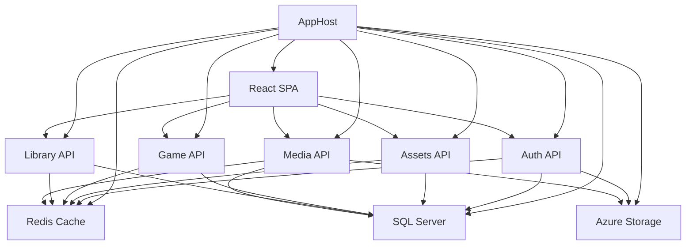

# VTTTools Frontend Implementation Guide

## Overview

This comprehensive guide provides all implementation standards, architectural patterns, and development practices for the VTTTools React migration. This document consolidates all scattered implementation details into a single authoritative reference for the development team.

**Project Context**: VTTTools is a professional Virtual Tabletop Tools application being migrated from Blazor to React 18+ with TypeScript, focusing on canvas-heavy creative workflows for content creators.

## 1. Technology Stack & Dependencies

### Core Frontend Stack
```json
{
  "react": "^18.2.0",
  "typescript": "^5.9.2",
  "konva": "^9.2.0",
  "react-konva": "^18.2.10",
  "@reduxjs/toolkit": "^1.9.5",
  "react-redux": "^8.1.1",
  "@microsoft/signalr": "^7.0.10",
  "axios": "^1.5.0",
  "react-router-dom": "^6.15.0",
  "react-hook-form": "^7.45.4",
  "@mui/material": "^5.14.8",
  "@mui/icons-material": "^5.14.8",
  "react-bootstrap": "^2.8.0",
  "bootstrap": "^5.3.2"
}
```

### Development & Build Tools
```json
{
  "vite": "^4.4.9",
  "vitest": "^0.34.4",
  "@testing-library/react": "^13.4.0",
  "@testing-library/jest-dom": "^6.1.3",
  "playwright": "^1.37.1",
  "msw": "^1.3.0",
  "eslint": "^8.48.0",
  "@typescript-eslint/eslint-plugin": "^6.7.2",
  "prettier": "^3.0.3",
  "husky": "^8.0.3",
  "lint-staged": "^14.0.1"
}
```

### Specialized Libraries
```json
{
  "react-dropzone": "^14.2.3",
  "react-window": "^1.8.8",
  "react-window-infinite-loader": "^1.0.9",
  "date-fns": "^2.30.0",
  "lodash-es": "^4.17.21",
  "use-sound": "^4.0.1"
}
```

## 2. .NET Aspire Integration Architecture

### Overall Solution Structure
```
VTTTools/ (Root Solution)
├── Source/
│   ├── AppHost/                    # .NET Aspire orchestration host
│   ├── WebApp/                     # ASP.NET Core host with Identity
│   ├── WebApp.Client/              # React SPA (NEW - replaces Blazor WASM)
│   ├── Assets/                     # Assets microservice (existing)
│   ├── Game/                       # Game sessions microservice (existing)
│   ├── Library/                    # Adventures/Scenes microservice (existing)
│   ├── Media/                      # Media resources microservice (existing)
│   ├── Domain/                     # Shared API contracts (existing)
│   ├── Core/                       # Application services (existing)
│   ├── Data/                       # Entity Framework context (existing)
│   └── Common/                     # Shared utilities (existing)
└── Documents/
    └── Tasks/VTTTools_Frontend_Migration/
        ├── IMPLEMENTATION_GUIDE.md # This document
        └── WebClientApp/           # VttTools.WebClientApp React SPA (NEW)
            ├── src/
            │   ├── components/      # Reusable React components
            │   │   ├── ui/         # Basic UI components
            │   │   ├── forms/      # Form components with validation
            │   │   ├── layout/     # Layout and navigation components
            │   │   ├── auth/       # Authentication-specific components
            │   │   ├── canvas/     # Konva.js Scene Builder components
            │   │   └── shared/     # Cross-feature shared components
            │   ├── pages/          # Page-level route components
            │   │   ├── auth/       # Authentication pages
            │   │   ├── adventures/ # Adventure management pages
            │   │   ├── assets/     # Asset management pages
            │   │   ├── sessions/   # Game session pages
            │   │   └── scenes/     # Scene Builder pages
            │   ├── services/       # API clients for existing microservices
            │   │   ├── assetsApi.ts      # Assets microservice client
            │   │   ├── gameApi.ts        # Game microservice client
            │   │   ├── libraryApi.ts     # Library microservice client
            │   │   ├── mediaApi.ts       # Media microservice client
            │   │   └── authApi.ts        # Auth microservice client
            │   ├── types/          # TypeScript definitions from Domain contracts
            │   ├── hooks/          # Custom React hooks
            │   ├── store/          # Redux Toolkit state management
            │   ├── utils/          # Utility functions and helpers
            │   ├── constants/      # Application constants
            │   └── styles/         # Global styles and themes
            ├── public/
            ├── package.json
            ├── vite.config.ts
            └── tsconfig.json
```

### Aspire Service Architecture
The React SPA integrates with the existing .NET Aspire infrastructure:

**Development Environment:**
- **AppHost** orchestrates all services including the new React app
- **Service Discovery** automatically resolves microservice endpoints
- **Shared Infrastructure** (Redis, SQL Server, Azure Storage) already configured
- **Authentication** handled by VttTools.Auth microservice with ASP.NET Core Identity

**Service Dependencies:**


### 2.1 Project Structure and Solution Integration

**Project Details**:
- **Project Name**: VttTools.WebClientApp
- **Location**: Source\WebClientApp\
- **Solution Folder**: "3 WebApp" (alongside WebApp, WebApp.Common, WebApp.WebAssembly)
- **Solution File**: Add to VttTools.sln with proper references
- **Project Type**: React SPA integrated with .NET Aspire infrastructure

**Solution File Integration**:
```xml
<!-- Add to VttTools.sln in "3 WebApp" solution folder -->
Project("{54A90642-561A-4BB1-A94E-469ADEE60C69}") = "VttTools.WebClientApp", "WebClientApp\VttTools.WebClientApp.esproj", "{GENERATE-NEW-GUID}"
EndProject
```

**Project References Required**:
```xml
<!-- In VttTools.WebClientApp.esproj -->
<ItemGroup>
  <ProjectReference Include="..\WebApp.Common\VttTools.WebApp.Common.csproj" />
  <ProjectReference Include="..\Domain\VttTools.Domain.csproj" />
</ItemGroup>
```

### 2.1 Project Creation Tool Sequence

**Critical Tool Usage Guidance for Devops-Specialist**:

**Step 1: Create React Project Structure**
```bash
# Navigate to Source directory
cd Source

# Create React + TypeScript + Vite project
npm create vite@latest WebClientApp -- --template react-ts
cd WebClientApp
npm install
```

**Step 2: Install Required Dependencies**
```bash
# Material UI and theming
npm install @mui/material @emotion/react @emotion/styled
npm install @mui/icons-material

# Konva.js for Scene Builder
npm install konva react-konva
npm install @types/konva

# State management and API
npm install @reduxjs/toolkit react-redux
npm install axios

# SignalR for real-time features
npm install @microsoft/signalr

# Testing libraries
npm install --save-dev @testing-library/react @testing-library/jest-dom
npm install --save-dev @playwright/test
```

**Step 3: Create .NET Project Integration**
```xml
<!-- Create VttTools.WebClientApp.esproj file manually -->
<Project Sdk="Microsoft.NET.Sdk">
  <PropertyGroup>
    <TargetFramework>net9.0</TargetFramework>
    <Nullable>enable</Nullable>
    <ImplicitUsings>enable</ImplicitUsings>
    <RootNamespace>VttTools.WebClientApp</RootNamespace>
  </PropertyGroup>

  <ItemGroup>
    <ProjectReference Include="..\WebApp.Common\VttTools.WebApp.Common.csproj" />
    <ProjectReference Include="..\Domain\VttTools.Domain.csproj" />
  </ItemGroup>

  <!-- NPM build integration -->
  <Target Name="BuildReact" BeforeTargets="Build">
    <Exec Command="npm run build" WorkingDirectory="$(MSBuildProjectDirectory)" />
  </Target>

  <Target Name="InstallReactDeps" BeforeTargets="BuildReact">
    <Exec Command="npm install" WorkingDirectory="$(MSBuildProjectDirectory)" />
  </Target>
</Project>
```

**Step 4: Add to .NET Solution**
```bash
# Navigate back to solution root
cd ..

# Add project to solution in "3 WebApp" folder
dotnet sln VttTools.sln add WebClientApp\VttTools.WebClientApp.esproj --solution-folder "3 WebApp"

# Verify project was added correctly
dotnet sln list
```

**Step 5: Configure Aspire Integration**
```csharp
// Update Source/AppHost/Program.cs
var webClientApp = builder.AddNpmApp("webclientapp", "../WebClientApp")
                         .WithReference(cache)
                         .WithReference(database)
                         .WithReference(blobs)
                         .WithReference(assets).WaitFor(assets)
                         .WithReference(library).WaitFor(library)
                         .WithReference(game).WaitFor(game)
                         .WithReference(resources).WaitFor(resources);
```

### 2.2 Backend Service Organization

**Assets Service** (`VttTools.Assets`):
- **Endpoints**: /api/assets/*
- **Responsibility**: Asset CRUD operations, categorization, metadata management
- **Required For**: UC017-UC025 (Asset Management), UC050 (Asset Library)
- **Contracts**: CreateAssetRequest, UpdateAssetRequest, Asset response types
- **Location**: Source\Assets\

**Library Service** (`VttTools.Library`):
- **Endpoints**: /api/adventures/*, /api/scenes/*
- **Responsibility**: Adventure and scene management, content organization
- **Required For**: UC012-UC016 (Adventure Management), UC047-UC056 (Scene Builder)
- **Contracts**: CreateAdventureRequest, CreateSceneRequest, scene management types
- **Location**: Source\Library\

**Game Service** (`VttTools.Game`):
- **Endpoints**: /api/sessions/*, /api/chat/*
- **Responsibility**: Session management, multiplayer coordination, real-time features
- **Required For**: UC026-UC030 (Sessions and Chat)
- **Contracts**: CreateGameSessionRequest, JoinGameSessionRequest, chat message types
- **Location**: Source\Game\

**Media Service** (`VttTools.Media`):
- **Endpoints**: /api/media/*, /api/resources/*
- **Responsibility**: File uploads, image processing, Azure Blob Storage integration
- **Required For**: UC025 (Upload Assets), UC048 (Background Images)
- **Contracts**: UploadRequest, resource management types
- **Location**: Source\Media\

**Auth Service** (`VttTools.Auth`):
- **Endpoints**: /api/auth/*
- **Responsibility**: User authentication, registration, session management
- **Required For**: UC003-UC011 (Authentication and Profile)
- **Contracts**: LoginRequest, RegisterRequest, AuthResponse
- **Integration**: Replaces WebApp authentication functionality
- **Location**: Source\Auth\

**Development Startup Sequence**:
```bash
# Single command starts entire solution including React app
dotnet run --project Source/AppHost

# Alternative: Development mode with React hot reload
cd Source/WebClientApp
npm run dev  # React development server with Vite proxy to Aspire services

# All backend services must be running for React development:
# 1. Auth (authentication endpoints)
# 2. Assets (asset management APIs)
# 3. Library (adventure/scene APIs)
# 4. Game (session management APIs)
# 5. Media (file upload APIs)
# 5. Game (session/chat APIs)
```

**Tool Usage Guidelines**:
- **dotnet CLI**: Solution management, project references, Aspire orchestration
- **npm CLI**: React project creation, dependency management, development server
- **Combined**: Both tools work together - .NET for solution integration, npm for React development
- **No CORS Required**: React app replaces WebApp projects, communicates directly with microservices via service discovery

### Component Architecture Patterns
- **Functional Components Only**: React 18+ functional components with hooks
- **Component Composition**: Favor composition over inheritance using children props
- **Container-Presentational Pattern**: Separate data/logic from UI rendering
- **Custom Hooks**: Extract reusable logic following `use` prefix convention
- **Error Boundaries**: Feature isolation and graceful failure handling
- **Service Integration**: Direct consumption of existing API contracts from Domain layer

## 3. .NET Aspire Service Integration

### AppHost Registration Pattern
The React SPA will be registered in the existing AppHost alongside other services:

```csharp
// In Source/AppHost/Program.cs - ADD after existing services
var webClientApp = builder.AddNpmApp("webclientapp", "../WebClientApp")
                     .WithReference(cache)
                     .WithReference(database)
                     .WithReference(blobs)
                     .WithReference(resources).WaitFor(resources)
                     .WithReference(assets).WaitFor(assets)
                     .WithReference(library).WaitFor(library)
                     .WithReference(game).WaitFor(game)
                     .WithReference(webApp).WaitFor(webApp)
                     .WithHttpHealthCheck("health")
                     .WithEndpoint("https", endpoint => endpoint.IsProxied = !isDevelopment);
```

### Service Discovery Configuration
React SPA uses Aspire service discovery through Vite proxy configuration:

```typescript
// vite.config.ts
import { defineConfig } from 'vite';
import react from '@vitejs/plugin-react';

export default defineConfig({
  plugins: [react()],
  server: {
    proxy: {
      // Aspire service discovery endpoints
      '/api/auth': 'https+http://webapp',           // Identity endpoints
      '/api/assets': 'https+http://assets-api',     // Assets microservice
      '/api/adventures': 'https+http://library-api', // Library microservice
      '/api/scenes': 'https+http://library-api',    // Scene endpoints
      '/api/sessions': 'https+http://game-api',     // Game sessions
      '/api/media': 'https+http://resources-api',   // Media resources
      '/signalr': {
        target: 'https+http://game-api',
        ws: true,
        changeOrigin: true
      },
    },
  },
  build: {
    outDir: 'dist',
    emptyOutDir: true,
  },
});
```

### Existing API Contract Integration
The React app consumes existing API contracts from the Domain layer:

**TypeScript Type Generation from C# Contracts:**
```bash
# Use existing API contracts - no code generation needed
# Import types directly from Domain layer documentation
```

**Example API Service Implementation:**
```typescript
// src/services/adventuresApi.ts
import { CreateAdventureRequest, UpdateAdventureRequest, Adventure } from '@/types/domain';

const ADVENTURES_BASE_URL = '/api/adventures';

export class AdventuresApi {
  // Uses existing CreateAdventureRequest from Domain.Library.Adventures.ApiContracts
  async createAdventure(request: CreateAdventureRequest): Promise<Adventure> {
    const response = await fetch(ADVENTURES_BASE_URL, {
      method: 'POST',
      headers: { 'Content-Type': 'application/json' },
      body: JSON.stringify(request),
      credentials: 'include' // Use existing Identity cookies
    });

    if (!response.ok) {
      throw new Error(`Failed to create adventure: ${response.statusText}`);
    }

    return response.json();
  }

  // Uses existing endpoints - no new API development
  async getAdventures(): Promise<Adventure[]> {
    const response = await fetch(ADVENTURES_BASE_URL, {
      credentials: 'include'
    });

    if (!response.ok) {
      throw new Error(`Failed to get adventures: ${response.statusText}`);
    }

    return response.json();
  }

  // Uses existing UpdateAdventureRequest from Domain layer
  async updateAdventure(id: string, request: UpdateAdventureRequest): Promise<Adventure> {
    const response = await fetch(`${ADVENTURES_BASE_URL}/${id}`, {
      method: 'PUT',
      headers: { 'Content-Type': 'application/json' },
      body: JSON.stringify(request),
      credentials: 'include'
    });

    if (!response.ok) {
      throw new Error(`Failed to update adventure: ${response.statusText}`);
    }

    return response.json();
  }
}
```

### Development Workflow
**Start Development Environment:**
```bash
# Start all services including React SPA
dotnet run --project Source/AppHost

# React SPA runs automatically as part of Aspire orchestration
# Available at: https://localhost:[assigned-port]
# All microservices available via service discovery
```

**Service Health Monitoring:**
```bash
# Aspire Dashboard shows all services including React SPA
# Navigate to: https://localhost:17086 (Aspire Dashboard)
# Monitor: React SPA, Assets API, Game API, Library API, Media API, WebApp
```

**Authentication Flow:**
1. React SPA redirects to `/api/auth/login` (WebApp Identity)
2. User authenticates via existing ASP.NET Core Identity
3. Authentication cookies automatically included in API requests
4. All microservice calls authenticated via existing handlers

## 4. React Development Standards

### Component Structure Template
```typescript
import React, { useState, useEffect, useMemo, useCallback } from 'react';

interface ComponentProps {
  data: DataType;
  onAction: (payload: ActionPayload) => void;
  className?: string;
  children?: React.ReactNode;
}

const Component: React.FC<ComponentProps> = ({ 
  data, 
  onAction, 
  className = '',
  children 
}) => {
  // State declarations
  const [localState, setLocalState] = useState<StateType>(initialState);
  
  // Memoized values
  const processedData = useMemo(() => {
    return expensiveDataProcessing(data);
  }, [data]);
  
  // Callbacks
  const handleAction = useCallback((event: React.MouseEvent) => {
    onAction({ type: 'ACTION_TYPE', data: processedData });
  }, [onAction, processedData]);
  
  // Effects
  useEffect(() => {
    // Side effects
  }, [dependencies]);

  return (
    <div className={`component-root ${className}`}>
      {/* Component JSX */}
      {children}
    </div>
  );
};

export default Component;
```

### Performance Optimization Patterns
```typescript
// Memoization for expensive calculations
const ExpensiveComponent: React.FC<Props> = ({ data, onUpdate }) => {
  const processedData = useMemo(() => {
    return expensiveCalculation(data);
  }, [data]);
  
  const memoizedCallback = useCallback((value: string) => {
    onUpdate(value);
  }, [onUpdate]);
  
  const MemoizedChild = useMemo(() => React.memo(ChildComponent), []);
  
  return <MemoizedChild data={processedData} onChange={memoizedCallback} />;
};

// Virtualization for large lists
import { FixedSizeList as List } from 'react-window';

const VirtualizedAssetList: React.FC<VirtualizedAssetListProps> = ({
  assets,
  onAssetSelect,
  height = 400
}) => {
  const Row = ({ index, style }: { index: number; style: React.CSSProperties }) => (
    <div style={style}>
      <AssetItem 
        asset={assets[index]} 
        onSelect={onAssetSelect}
      />
    </div>
  );

  return (
    <List
      height={height}
      itemCount={assets.length}
      itemSize={80}
    >
      {Row}
    </List>
  );
};
```

## 4. TypeScript Standards

### Strict Configuration
```json
{
  "compilerOptions": {
    "strict": true,
    "noImplicitAny": true,
    "strictNullChecks": true,
    "strictFunctionTypes": true,
    "noImplicitReturns": true,
    "noFallthroughCasesInSwitch": true,
    "noUncheckedIndexedAccess": true,
    "exactOptionalPropertyTypes": true
  }
}
```

### Type Definition Patterns
```typescript
// API Response Types
interface ApiResponse<T> {
  data: T;
  success: boolean;
  message?: string;
  errors?: ValidationError[];
}

// Component Prop Types with Generics
interface DataTableProps<T> {
  data: T[];
  columns: ColumnDefinition<T>[];
  onRowSelect?: (row: T) => void;
  loading?: boolean;
}

// State Management Types
interface AppState {
  auth: AuthState;
  ui: UIState;
  features: {
    adventures: AdventureState;
    assets: AssetState;
    scenes: SceneState;
  };
}

// Event Handler Types
type EventHandler<T = HTMLElement> = (event: React.FormEvent<T>) => void;
type ChangeHandler<T = HTMLInputElement> = (event: React.ChangeEvent<T>) => void;

// Utility Types
type Partial<T> = { [P in keyof T]?: T[P] };
type Required<T> = { [P in keyof T]-?: T[P] };
type Omit<T, K extends keyof T> = Pick<T, Exclude<keyof T, K>>;
```

## 5. Material UI Integration

### Theme Configuration
```typescript
import { createTheme, ThemeOptions } from '@mui/material/styles';

export const vttToolsTheme = createTheme({
  palette: {
    mode: 'dark',
    primary: {
      main: '#4A90E2',
      light: '#7BB3F0',
      dark: '#2E5984',
      contrastText: '#FFFFFF',
    },
    secondary: {
      main: '#E94B3C',
      light: '#FF7961',
      dark: '#B71C1C',
      contrastText: '#FFFFFF',
    },
    background: {
      default: '#1A1A1A',
      paper: '#2D2D2D',
    },
    text: {
      primary: '#FFFFFF',
      secondary: 'rgba(255, 255, 255, 0.7)',
    },
  },
  typography: {
    fontFamily: '"Inter", "Roboto", "Helvetica", "Arial", sans-serif',
    h1: {
      fontSize: '2.5rem',
      fontWeight: 700,
      lineHeight: 1.2,
    },
    // Custom typography variants
    vttHeading: {
      fontSize: '1.75rem',
      fontWeight: 600,
      color: '#4A90E2',
    },
    vttBody: {
      fontSize: '1rem',
      lineHeight: 1.6,
    },
  },
  components: {
    MuiButton: {
      styleOverrides: {
        root: {
          borderRadius: 8,
          textTransform: 'none',
          fontWeight: 500,
        },
        contained: {
          boxShadow: 'none',
          '&:hover': {
            boxShadow: '0 2px 8px rgba(0,0,0,0.15)',
          },
        },
      },
    },
    MuiCard: {
      styleOverrides: {
        root: {
          backgroundColor: '#2D2D2D',
          borderRadius: 12,
          boxShadow: '0 2px 12px rgba(0,0,0,0.1)',
        },
      },
    },
  },
});

// Module augmentation for custom typography
declare module '@mui/material/styles' {
  interface TypographyVariants {
    vttHeading: React.CSSProperties;
    vttBody: React.CSSProperties;
  }
  
  interface TypographyVariantsOptions {
    vttHeading?: React.CSSProperties;
    vttBody?: React.CSSProperties;
  }
}
```

## 6. Konva.js Canvas Architecture

### Multi-Layer Canvas Structure
```typescript
import Konva from 'konva';
import { Stage, Layer } from 'react-konva';

interface SceneBuilderCanvasProps {
  scene: Scene;
  onSceneUpdate: (scene: Scene) => void;
  canvasSize: { width: number; height: number };
}

const SceneBuilderCanvas: React.FC<SceneBuilderCanvasProps> = ({
  scene,
  onSceneUpdate,
  canvasSize,
}) => {
  const stageRef = useRef<Konva.Stage>(null);
  const backgroundLayerRef = useRef<Konva.Layer>(null);
  const gridLayerRef = useRef<Konva.Layer>(null);
  const assetsLayerRef = useRef<Konva.Layer>(null);
  const dragLayerRef = useRef<Konva.Layer>(null);

  // Performance optimization: disable listening on static layers
  useEffect(() => {
    if (backgroundLayerRef.current) {
      backgroundLayerRef.current.listening(false);
    }
    if (gridLayerRef.current) {
      gridLayerRef.current.listening(false);
    }
  }, []);

  return (
    <Stage
      ref={stageRef}
      width={canvasSize.width}
      height={canvasSize.height}
      onWheel={handleZoom}
      onMouseDown={handleDragStart}
    >
      {/* Background Layer - Static, no interaction */}
      <Layer ref={backgroundLayerRef}>
        {scene.backgroundImage && (
          <BackgroundImage 
            src={scene.backgroundImage} 
            size={canvasSize}
          />
        )}
      </Layer>
      
      {/* Grid Layer - Static, no interaction */}
      <Layer ref={gridLayerRef}>
        {scene.gridVisible && (
          <GridSystem 
            type={scene.gridType}
            size={scene.gridSize}
            visible={scene.gridVisible}
          />
        )}
      </Layer>
      
      {/* Assets Layer - Interactive */}
      <Layer ref={assetsLayerRef}>
        {scene.assets.map(asset => (
          <AssetShape
            key={asset.id}
            asset={asset}
            onUpdate={updateAsset}
            onDragStart={moveAssetToDragLayer}
            onDragEnd={moveAssetFromDragLayer}
            perfectDrawEnabled={false} // Performance optimization
          />
        ))}
      </Layer>
      
      {/* Drag Layer - For smooth dragging */}
      <Layer ref={dragLayerRef} />
    </Stage>
  );
};
```

### Performance Optimization Patterns
```typescript
// Asset Shape Component with Caching
const AssetShape: React.FC<AssetShapeProps> = ({
  asset,
  onUpdate,
  onDragStart,
  onDragEnd,
}) => {
  const shapeRef = useRef<Konva.Image>(null);
  const [image, setImage] = useState<HTMLImageElement | null>(null);

  // Image caching and loading
  useEffect(() => {
    const img = new window.Image();
    img.onload = () => {
      setImage(img);
      // Cache the image for reuse
      Konva.Image.fromURL(asset.imageUrl, (konvaImg) => {
        konvaImg.cache();
        setImage(img);
      });
    };
    img.src = asset.imageUrl;
  }, [asset.imageUrl]);

  // Performance monitoring
  const [renderTime, setRenderTime] = useState(0);
  useEffect(() => {
    const startTime = performance.now();
    const endTime = performance.now();
    setRenderTime(endTime - startTime);
  });

  return (
    <Image
      ref={shapeRef}
      image={image}
      x={asset.x}
      y={asset.y}
      width={asset.width}
      height={asset.height}
      rotation={asset.rotation}
      scaleX={asset.scaleX}
      scaleY={asset.scaleY}
      draggable={!asset.locked}
      perfectDrawEnabled={false} // Performance optimization
      listening={!asset.locked}
      onDragStart={onDragStart}
      onDragEnd={onDragEnd}
      onTransform={onUpdate}
    />
  );
};

// Performance monitoring hook
const useKonvaPerformance = () => {
  const [fps, setFps] = useState(60);
  const [renderTime, setRenderTime] = useState(0);
  
  useEffect(() => {
    const monitor = () => {
      const start = performance.now();
      requestAnimationFrame(() => {
        const end = performance.now();
        setRenderTime(end - start);
        setFps(Math.round(1000 / (end - start)));
      });
    };
    
    const interval = setInterval(monitor, 1000);
    return () => clearInterval(interval);
  }, []);
  
  return { fps, renderTime };
};
```

## 7. State Management with Existing Microservices

### Store Configuration with Existing APIs
```typescript
import { configureStore } from '@reduxjs/toolkit';
import { setupListeners } from '@reduxjs/toolkit/query';

// Feature slices
import authSlice from './slices/authSlice';
import uiSlice from './slices/uiSlice';

// RTK Query APIs for existing microservices
import { authApi } from './apis/authApi';          // WebApp Identity endpoints
import { adventuresApi } from './apis/adventuresApi'; // Library microservice
import { assetsApi } from './apis/assetsApi';       // Assets microservice
import { gameSessionsApi } from './apis/gameSessionsApi'; // Game microservice
import { mediaApi } from './apis/mediaApi';         // Media microservice

export const store = configureStore({
  reducer: {
    // Feature slices - minimal local state
    auth: authSlice,
    ui: uiSlice,

    // RTK Query API slices - connect to existing microservices
    [authApi.reducerPath]: authApi.reducer,
    [adventuresApi.reducerPath]: adventuresApi.reducer,
    [assetsApi.reducerPath]: assetsApi.reducer,
    [gameSessionsApi.reducerPath]: gameSessionsApi.reducer,
    [mediaApi.reducerPath]: mediaApi.reducer,
  },
  middleware: (getDefaultMiddleware) =>
    getDefaultMiddleware({
      serializableCheck: {
        ignoredActions: ['persist/PERSIST', 'persist/REHYDRATE'],
      },
    })
    .concat(authApi.middleware)
    .concat(adventuresApi.middleware)
    .concat(assetsApi.middleware)
    .concat(gameSessionsApi.middleware)
    .concat(mediaApi.middleware),
});

setupListeners(store.dispatch);

export type RootState = ReturnType<typeof store.getState>;
export type AppDispatch = typeof store.dispatch;
```

### RTK Query API for Existing Library Microservice
```typescript
import { createApi, fetchBaseQuery } from '@reduxjs/toolkit/query/react';
import type {
  CreateAdventureRequest,
  UpdateAdventureRequest,
  Adventure,
  CreateSceneRequest,
  UpdateSceneRequest,
  Scene
} from '@/types/domain'; // Types from existing Domain layer

export const adventuresApi = createApi({
  reducerPath: 'adventuresApi',
  baseQuery: fetchBaseQuery({
    baseUrl: '/api/adventures', // Proxied to library-api via Vite/Aspire
    credentials: 'include',     // Use existing Identity cookies
    prepareHeaders: (headers) => {
      headers.set('Content-Type', 'application/json');
      return headers;
    },
  }),
  tagTypes: ['Adventure', 'Scene'],
  endpoints: (builder) => ({
    // Uses existing Library microservice endpoints
    getAdventures: builder.query<Adventure[], void>({
      query: () => '',
      providesTags: ['Adventure'],
    }),

    getAdventure: builder.query<Adventure, string>({
      query: (id) => `/${id}`,
      providesTags: (result, error, id) => [{ type: 'Adventure', id }],
    }),

    // Uses existing CreateAdventureRequest from Domain.Library.Adventures.ApiContracts
    createAdventure: builder.mutation<Adventure, CreateAdventureRequest>({
      query: (request) => ({
        url: '',
        method: 'POST',
        body: request, // Matches existing C# contract exactly
      }),
      invalidatesTags: ['Adventure'],
    }),

    // Uses existing UpdateAdventureRequest from Domain layer
    updateAdventure: builder.mutation<Adventure, { id: string; request: UpdateAdventureRequest }>({
      query: ({ id, request }) => ({
        url: `/${id}`,
        method: 'PUT',
        body: request, // Matches existing C# contract exactly
      }),
      invalidatesTags: (result, error, { id }) => [{ type: 'Adventure', id }],
    }),

    deleteAdventure: builder.mutation<void, string>({
      query: (id) => ({
        url: `/${id}`,
        method: 'DELETE',
      }),
      invalidatesTags: ['Adventure'],
    }),

    // Scene endpoints - also in Library microservice
    getScenes: builder.query<Scene[], string>({
      query: (adventureId) => `/${adventureId}/scenes`,
      providesTags: ['Scene'],
    }),

    createScene: builder.mutation<Scene, { adventureId: string; request: CreateSceneRequest }>({
      query: ({ adventureId, request }) => ({
        url: `/${adventureId}/scenes`,
        method: 'POST',
        body: request, // Uses existing Domain.Library.Scenes.ApiContracts
      }),
      invalidatesTags: ['Scene'],
    }),

    updateScene: builder.mutation<Scene, { adventureId: string; sceneId: string; request: UpdateSceneRequest }>({
      query: ({ adventureId, sceneId, request }) => ({
        url: `/${adventureId}/scenes/${sceneId}`,
        method: 'PUT',
        body: request, // Uses existing Domain.Library.Scenes.ApiContracts
      }),
      invalidatesTags: ['Scene'],
    }),
  }),
});

export const {
  useGetAdventuresQuery,
  useGetAdventureQuery,
  useCreateAdventureMutation,
  useUpdateAdventureMutation,
  useDeleteAdventureMutation,
  useGetScenesQuery,
  useCreateSceneMutation,
  useUpdateSceneMutation,
} = adventuresApi;
```

### RTK Query API for Existing Assets Microservice
```typescript
import type { CreateAssetRequest, UpdateAssetRequest, Asset } from '@/types/domain';

export const assetsApi = createApi({
  reducerPath: 'assetsApi',
  baseQuery: fetchBaseQuery({
    baseUrl: '/api/assets', // Proxied to assets-api via Vite/Aspire
    credentials: 'include',
  }),
  tagTypes: ['Asset'],
  endpoints: (builder) => ({
    getAssets: builder.query<Asset[], void>({
      query: () => '',
      providesTags: ['Asset'],
    }),

    // Uses existing CreateAssetRequest from Domain.Assets.ApiContracts
    createAsset: builder.mutation<Asset, CreateAssetRequest>({
      query: (request) => ({
        url: '',
        method: 'POST',
        body: request,
      }),
      invalidatesTags: ['Asset'],
    }),

    // Uses existing UpdateAssetRequest from Domain.Assets.ApiContracts
    updateAsset: builder.mutation<Asset, { id: string; request: UpdateAssetRequest }>({
      query: ({ id, request }) => ({
        url: `/${id}`,
        method: 'PUT',
        body: request,
      }),
      invalidatesTags: ['Asset'],
    }),
  }),
});

export const {
  useGetAssetsQuery,
  useCreateAssetMutation,
  useUpdateAssetMutation,
} = assetsApi;
```

### Authentication Integration with Existing Identity
```typescript
// Uses existing WebApp ASP.NET Core Identity
export const authApi = createApi({
  reducerPath: 'authApi',
  baseQuery: fetchBaseQuery({
    baseUrl: '/api/auth', // Proxied to webapp via Vite/Aspire
    credentials: 'include',
  }),
  tagTypes: ['User'],
  endpoints: (builder) => ({
    login: builder.mutation<{ success: boolean }, { email: string; password: string }>({
      query: (credentials) => ({
        url: '/login',
        method: 'POST',
        body: credentials,
      }),
    }),

    logout: builder.mutation<void, void>({
      query: () => ({
        url: '/logout',
        method: 'POST',
      }),
    }),

    getCurrentUser: builder.query<User, void>({
      query: () => '/me',
      providesTags: ['User'],
    }),
  }),
});

export const {
  useLoginMutation,
  useLogoutMutation,
  useGetCurrentUserQuery,
} = authApi;
```

## 8. Form Management & Validation

### React Hook Form Standards
```typescript
import { useForm, Controller } from 'react-hook-form';
import { yupResolver } from '@hookform/resolvers/yup';
import * as yup from 'yup';

// Validation schema
const adventureSchema = yup.object().shape({
  title: yup.string().required('Title is required').min(3, 'Title must be at least 3 characters'),
  description: yup.string().max(500, 'Description cannot exceed 500 characters'),
  tags: yup.array().of(yup.string()).max(10, 'Maximum 10 tags allowed'),
  visibility: yup.string().oneOf(['public', 'private', 'friends']).required(),
});

interface AdventureFormProps {
  initialData?: Partial<Adventure>;
  onSubmit: (data: AdventureFormData) => void;
  loading?: boolean;
}

const AdventureForm: React.FC<AdventureFormProps> = ({
  initialData,
  onSubmit,
  loading = false,
}) => {
  const {
    control,
    handleSubmit,
    formState: { errors, isDirty, isValid },
    reset,
    watch,
  } = useForm<AdventureFormData>({
    resolver: yupResolver(adventureSchema),
    defaultValues: {
      title: '',
      description: '',
      tags: [],
      visibility: 'private',
      ...initialData,
    },
  });

  const watchedValues = watch();

  return (
    <form onSubmit={handleSubmit(onSubmit)}>
      <Controller
        name="title"
        control={control}
        render={({ field }) => (
          <TextField
            {...field}
            label="Adventure Title"
            error={!!errors.title}
            helperText={errors.title?.message}
            fullWidth
            margin="normal"
          />
        )}
      />
      
      <Controller
        name="description"
        control={control}
        render={({ field }) => (
          <TextField
            {...field}
            label="Description"
            multiline
            rows={4}
            error={!!errors.description}
            helperText={errors.description?.message}
            fullWidth
            margin="normal"
          />
        )}
      />
      
      <Button
        type="submit"
        variant="contained"
        disabled={!isDirty || !isValid || loading}
        fullWidth
      >
        {loading ? 'Saving...' : 'Save Adventure'}
      </Button>
    </form>
  );
};
```

## 9. Testing Standards

### Unit Testing with Vitest & React Testing Library
```typescript
import { render, screen, fireEvent, waitFor } from '@testing-library/react';
import { vi } from 'vitest';
import { Provider } from 'react-redux';
import { ThemeProvider } from '@mui/material/styles';

// Test wrapper with all providers
const renderWithProviders = (component: React.ReactElement) => {
  const store = configureStore({
    reducer: {
      auth: authSlice,
      adventures: adventureSlice,
    },
  });

  return render(
    <Provider store={store}>
      <ThemeProvider theme={vttToolsTheme}>
        {component}
      </ThemeProvider>
    </Provider>
  );
};

// Component testing example
describe('AdventureCard', () => {
  const mockAdventure: Adventure = {
    id: '1',
    title: 'Test Adventure',
    description: 'Test description',
    createdAt: new Date().toISOString(),
    visibility: 'private',
  };

  it('renders adventure information correctly', () => {
    renderWithProviders(
      <AdventureCard adventure={mockAdventure} onEdit={vi.fn()} onDelete={vi.fn()} />
    );

    expect(screen.getByText('Test Adventure')).toBeInTheDocument();
    expect(screen.getByText('Test description')).toBeInTheDocument();
  });

  it('calls onEdit when edit button is clicked', async () => {
    const onEdit = vi.fn();
    renderWithProviders(
      <AdventureCard adventure={mockAdventure} onEdit={onEdit} onDelete={vi.fn()} />
    );

    fireEvent.click(screen.getByRole('button', { name: /edit/i }));
    
    await waitFor(() => {
      expect(onEdit).toHaveBeenCalledWith(mockAdventure.id);
    });
  });
});
```

### Integration Testing with MSW
```typescript
import { rest } from 'msw';
import { setupServer } from 'msw/node';

// Mock API handlers
const handlers = [
  rest.get('/api/adventures', (req, res, ctx) => {
    return res(
      ctx.json([
        { id: '1', title: 'Adventure 1' },
        { id: '2', title: 'Adventure 2' },
      ])
    );
  }),
  rest.post('/api/adventures', (req, res, ctx) => {
    return res(ctx.json({ id: '3', title: 'New Adventure' }));
  }),
];

const server = setupServer(...handlers);

beforeAll(() => server.listen());
afterEach(() => server.resetHandlers());
afterAll(() => server.close());

describe('AdventuresList Integration', () => {
  it('loads and displays adventures from API', async () => {
    render(<AdventuresList />);

    await waitFor(() => {
      expect(screen.getByText('Adventure 1')).toBeInTheDocument();
      expect(screen.getByText('Adventure 2')).toBeInTheDocument();
    });
  });
});
```

### E2E Testing with Playwright
```typescript
import { test, expect } from '@playwright/test';

test('complete adventure creation workflow', async ({ page }) => {
  // Login
  await page.goto('/login');
  await page.fill('[data-testid="email"]', 'test@example.com');
  await page.fill('[data-testid="password"]', 'password');
  await page.click('[data-testid="login-button"]');

  // Navigate to adventures
  await page.click('[data-testid="adventures-nav"]');
  await expect(page).toHaveURL('/adventures');

  // Create new adventure
  await page.click('[data-testid="new-adventure-button"]');
  await page.fill('[data-testid="adventure-title"]', 'Test Adventure');
  await page.fill('[data-testid="adventure-description"]', 'Test Description');
  await page.click('[data-testid="save-adventure"]');

  // Verify creation
  await expect(page.locator('[data-testid="adventure-card"]')).toContainText('Test Adventure');
});

test('scene builder performance', async ({ page }) => {
  await page.goto('/scenes/builder');
  
  // Measure initial load time
  const startTime = Date.now();
  await page.waitForSelector('[data-testid="konva-stage"]');
  const loadTime = Date.now() - startTime;
  
  expect(loadTime).toBeLessThan(3000); // 3 second requirement
  
  // Test canvas performance with 50 assets
  for (let i = 0; i < 50; i++) {
    await page.click('[data-testid="add-asset-button"]');
  }
  
  // Measure frame rate
  const fps = await page.evaluate(() => {
    return new Promise<number>((resolve) => {
      let frames = 0;
      const start = performance.now();
      
      function count() {
        frames++;
        if (performance.now() - start < 1000) {
          requestAnimationFrame(count);
        } else {
          resolve(frames);
        }
      }
      requestAnimationFrame(count);
    });
  });
  
  expect(fps).toBeGreaterThan(50); // 50fps requirement
});
```

## 10. Error Handling & Monitoring

### Global Error Boundary
```typescript
interface ErrorBoundaryState {
  hasError: boolean;
  error: Error | null;
  errorInfo: React.ErrorInfo | null;
}

class GlobalErrorBoundary extends React.Component<
  React.PropsWithChildren<{}>,
  ErrorBoundaryState
> {
  constructor(props: React.PropsWithChildren<{}>) {
    super(props);
    this.state = { hasError: false, error: null, errorInfo: null };
  }

  static getDerivedStateFromError(error: Error): Partial<ErrorBoundaryState> {
    return { hasError: true, error };
  }

  componentDidCatch(error: Error, errorInfo: React.ErrorInfo) {
    this.setState({ errorInfo });
    
    // Log error to monitoring service
    console.error('Global Error Boundary caught an error:', {
      error: error.message,
      stack: error.stack,
      componentStack: errorInfo.componentStack,
      userId: getCurrentUserId(),
      timestamp: new Date().toISOString(),
      userAgent: navigator.userAgent,
      url: window.location.href,
    });
  }

  render() {
    if (this.state.hasError) {
      return (
        <ErrorFallback 
          error={this.state.error} 
          resetError={() => this.setState({ hasError: false, error: null, errorInfo: null })}
        />
      );
    }

    return this.props.children;
  }
}

// Error fallback component
const ErrorFallback: React.FC<{ error: Error | null; resetError: () => void }> = ({ 
  error, 
  resetError 
}) => {
  return (
    <Box 
      display="flex" 
      flexDirection="column" 
      alignItems="center" 
      justifyContent="center" 
      minHeight="100vh"
      p={3}
    >
      <Alert severity="error" sx={{ mb: 2, maxWidth: 600 }}>
        <AlertTitle>Something went wrong</AlertTitle>
        {error?.message || 'An unexpected error occurred'}
      </Alert>
      
      <Stack direction="row" spacing={2}>
        <Button variant="contained" onClick={resetError}>
          Try Again
        </Button>
        <Button variant="outlined" onClick={() => window.location.reload()}>
          Reload Page
        </Button>
      </Stack>
    </Box>
  );
};
```

### API Error Handling
```typescript
// Standardized API error response handling
interface ApiError {
  message: string;
  code: string;
  details?: Record<string, any>;
}

const handleApiError = (error: unknown): ApiError => {
  if (error instanceof AxiosError) {
    const response = error.response;
    
    if (response?.status === 401) {
      store.dispatch(authSlice.actions.logout());
      window.location.href = '/login';
      return { message: 'Authentication required', code: 'UNAUTHORIZED' };
    }
    
    if (response?.status === 403) {
      return { message: 'Access denied', code: 'FORBIDDEN' };
    }
    
    if (response?.status >= 500) {
      return { message: 'Server error. Please try again later.', code: 'SERVER_ERROR' };
    }
    
    if (response?.data?.message) {
      return { message: response.data.message, code: response.data.code || 'API_ERROR' };
    }
  }
  
  if (error instanceof Error) {
    return { message: error.message, code: 'UNKNOWN_ERROR' };
  }
  
  return { message: 'An unexpected error occurred', code: 'UNKNOWN_ERROR' };
};

// Error hook for components
export const useErrorHandler = () => {
  const [errors, setErrors] = useState<string[]>([]);

  const addError = useCallback((error: unknown) => {
    const apiError = handleApiError(error);
    setErrors(prev => [...prev, apiError.message]);
    
    // Auto-remove error after 5 seconds
    setTimeout(() => {
      setErrors(prev => prev.filter(e => e !== apiError.message));
    }, 5000);
  }, []);

  const removeError = useCallback((error: string) => {
    setErrors(prev => prev.filter(e => e !== error));
  }, []);

  const clearErrors = useCallback(() => {
    setErrors([]);
  }, []);

  return { errors, addError, removeError, clearErrors };
};
```

## 11. Performance Standards & Monitoring

### Performance Requirements
- **Initial Load**: < 3 seconds to interactive (Lighthouse metric)
- **Route Navigation**: < 500ms between page transitions
- **Canvas Rendering**: Minimum 50fps with up to 100 assets
- **API Response**: < 2 seconds for CRUD operations, < 5 seconds for file uploads
- **Real-time Latency**: < 100ms for SignalR message delivery

### Performance Monitoring Setup
```typescript
// Web Vitals monitoring
import { getCLS, getFID, getFCP, getLCP, getTTFB } from 'web-vitals';

const sendToAnalytics = (metric: any) => {
  console.log('Performance metric:', metric);
  // Send to your analytics service
};

// Measure core web vitals
getCLS(sendToAnalytics);
getFID(sendToAnalytics);
getFCP(sendToAnalytics);
getLCP(sendToAnalytics);
getTTFB(sendToAnalytics);

// Canvas performance monitoring
const useCanvasPerformance = () => {
  const [fps, setFps] = useState(60);
  const frameCountRef = useRef(0);
  const lastTimeRef = useRef(performance.now());

  useEffect(() => {
    const measureFPS = () => {
      frameCountRef.current++;
      const now = performance.now();
      
      if (now - lastTimeRef.current >= 1000) {
        setFps(frameCountRef.current);
        frameCountRef.current = 0;
        lastTimeRef.current = now;
      }
      
      requestAnimationFrame(measureFPS);
    };
    
    requestAnimationFrame(measureFPS);
  }, []);

  return fps;
};
```

## 12. Code Quality & Development Workflow

### ESLint Configuration
```json
{
  "extends": [
    "eslint:recommended",
    "@typescript-eslint/recommended",
    "plugin:react/recommended",
    "plugin:react-hooks/recommended",
    "plugin:jsx-a11y/recommended"
  ],
  "rules": {
    "react/prop-types": "off",
    "react/react-in-jsx-scope": "off",
    "@typescript-eslint/no-explicit-any": "error",
    "@typescript-eslint/explicit-function-return-type": "warn",
    "react-hooks/exhaustive-deps": "warn",
    "jsx-a11y/anchor-is-valid": "off",
    "prefer-const": "error",
    "no-var": "error"
  }
}
```

### Prettier Configuration
```json
{
  "semi": true,
  "trailingComma": "es5",
  "singleQuote": true,
  "printWidth": 100,
  "tabWidth": 2,
  "useTabs": false,
  "bracketSpacing": true,
  "arrowParens": "avoid"
}
```

### Pre-commit Hooks
```json
{
  "husky": {
    "hooks": {
      "pre-commit": "lint-staged",
      "commit-msg": "commitlint -E HUSKY_GIT_PARAMS"
    }
  },
  "lint-staged": {
    "src/**/*.{ts,tsx}": [
      "eslint --fix",
      "prettier --write",
      "git add"
    ],
    "src/**/*.{ts,tsx,json}": [
      "prettier --write",
      "git add"
    ]
  }
}
```

## 13. Build & Deployment with .NET Aspire Integration

### Aspire-Integrated Vite Configuration
```typescript
import { defineConfig } from 'vite';
import react from '@vitejs/plugin-react';
import { resolve } from 'path';

export default defineConfig({
  plugins: [react()],
  resolve: {
    alias: {
      '@': resolve(__dirname, 'src'),
      '@components': resolve(__dirname, 'src/components'),
      '@pages': resolve(__dirname, 'src/pages'),
      '@hooks': resolve(__dirname, 'src/hooks'),
      '@services': resolve(__dirname, 'src/services'),
      '@store': resolve(__dirname, 'src/store'),
      '@types': resolve(__dirname, 'src/types'),
      '@utils': resolve(__dirname, 'src/utils'),
    },
  },
  build: {
    target: 'esnext',
    minify: 'terser',
    outDir: 'dist',
    rollupOptions: {
      output: {
        manualChunks: {
          vendor: ['react', 'react-dom'],
          canvas: ['konva', 'react-konva'],
          ui: ['@mui/material', '@mui/icons-material'],
          state: ['@reduxjs/toolkit', 'react-redux'],
        },
      },
    },
  },
  server: {
    // Aspire service discovery via proxy
    proxy: {
      '/api/auth': {
        target: 'https+http://webapp',
        changeOrigin: true,
        secure: false,
      },
      '/api/assets': {
        target: 'https+http://assets-api',
        changeOrigin: true,
        secure: false,
      },
      '/api/adventures': {
        target: 'https+http://library-api',
        changeOrigin: true,
        secure: false,
      },
      '/api/scenes': {
        target: 'https+http://library-api',
        changeOrigin: true,
        secure: false,
      },
      '/api/sessions': {
        target: 'https+http://game-api',
        changeOrigin: true,
        secure: false,
      },
      '/api/media': {
        target: 'https+http://resources-api',
        changeOrigin: true,
        secure: false,
      },
      '/signalr': {
        target: 'https+http://game-api',
        ws: true,
        changeOrigin: true,
        secure: false,
      },
    },
  },
  // Health check endpoint for Aspire
  define: {
    __ASPIRE_HEALTH__: JSON.stringify(true),
  },
});
```

### Package.json for Aspire Integration
```json
{
  "name": "vtttools-WebClientApp",
  "version": "1.0.0",
  "type": "module",
  "scripts": {
    "dev": "vite",
    "build": "tsc && vite build",
    "preview": "vite preview --port 4173",
    "lint": "eslint . --ext ts,tsx --report-unused-disable-directives --max-warnings 0",
    "type-check": "tsc --noEmit",
    "test": "vitest",
    "test:e2e": "playwright test",
    "health": "curl -f http://localhost:5173/health || exit 1"
  },
  "dependencies": {
    "react": "^18.2.0",
    "typescript": "^5.9.2",
    "konva": "^9.2.0",
    "react-konva": "^18.2.10",
    "@reduxjs/toolkit": "^1.9.5",
    "react-redux": "^8.1.1",
    "@microsoft/signalr": "^7.0.10",
    "axios": "^1.5.0",
    "react-router-dom": "^6.15.0",
    "react-hook-form": "^7.45.4",
    "@mui/material": "^5.14.8",
    "@mui/icons-material": "^5.14.8"
  },
  "devDependencies": {
    "vite": "^4.4.9",
    "vitest": "^0.34.4",
    "@testing-library/react": "^13.4.0",
    "@testing-library/jest-dom": "^6.1.3",
    "playwright": "^1.37.1",
    "eslint": "^8.48.0",
    "@typescript-eslint/eslint-plugin": "^6.7.2",
    "prettier": "^3.0.3"
  }
}
```

### AppHost Registration for React SPA
```csharp
// In Source/AppHost/Program.cs - ADD after existing services
var webClientApp = builder.AddNpmApp("webclientapp", "../WebClientApp")
                     .WithReference(cache)
                     .WithReference(database)
                     .WithReference(blobs)
                     .WithReference(resources).WaitFor(resources)
                     .WithReference(assets).WaitFor(assets)
                     .WithReference(library).WaitFor(library)
                     .WithReference(game).WaitFor(game)
                     .WithReference(webApp).WaitFor(webApp)
                     .WithHttpHealthCheck("health")
                     .WithEnvironment("NODE_ENV", isDevelopment ? "development" : "production")
                     .WithEndpoint("https", endpoint => {
                         endpoint.Port = isDevelopment ? 5173 : null; // Vite default port in dev
                         endpoint.IsProxied = !isDevelopment;
                     });

// Update existing webapp to reference React SPA
builder.AddProject<Projects.VttTools_WebApp>("webapp")
       .WithReference(cache)
       .WithReference(database)
       .WithReference(blobs)
       .WithReference(resources).WaitFor(resources)
       .WithReference(assets).WaitFor(assets)
       .WithReference(library).WaitFor(library)
       .WithReference(game).WaitFor(game)
       .WithReference(reactSpa).WaitFor(reactSpa) // NEW: Wait for React SPA
       .WaitFor(migrationService)
       .WithHttpHealthCheck("health")
       .WithEndpoint("https", endpoint => endpoint.IsProxied = !isDevelopment);
```

### CI/CD Integration with Existing Pipeline
```yaml
# Add to existing pipeline - likely in .github/workflows/ or similar
- name: Build React SPA
  working-directory: Documents/Tasks/VTTTools_Frontend_Migration/WebClientApp
  run: |
    npm ci
    npm run build
    npm run test

- name: Build .NET Solution (includes React SPA via Aspire)
  run: |
    dotnet restore
    dotnet build --configuration Release
    dotnet test --configuration Release --no-build

- name: Publish Aspire Application (includes React SPA)
  run: |
    dotnet publish Source/AppHost --configuration Release --output ./publish
```

### Production Deployment with Aspire
```bash
# Deploy entire application including React SPA via Aspire
dotnet publish Source/AppHost --configuration Release

# Aspire handles:
# - React SPA build and hosting
# - Service discovery configuration
# - Load balancing and scaling
# - Health checks and monitoring
# - SSL certificate management
```

### Development Environment Commands
```bash
# Start entire development environment including React SPA
dotnet run --project Source/AppHost

# Available services after startup:
# - React SPA: https://localhost:5173 (or assigned port)
# - Assets API: https://localhost:[port]
# - Game API: https://localhost:[port]
# - Library API: https://localhost:[port]
# - Media API: https://localhost:[port]
# - WebApp Identity: https://localhost:[port]
# - Aspire Dashboard: https://localhost:17086

# Individual React SPA development (for frontend-focused work)
cd Documents/Tasks/VTTTools_Frontend_Migration/WebClientApp
npm run dev
# Note: Still requires backend services via: dotnet run --project ../../../Source/AppHost
```

### Health Check Implementation for Aspire
```typescript
// src/health.ts - Health check endpoint for Aspire monitoring
export const setupHealthCheck = () => {
  // Simple health check endpoint
  if (import.meta.env.PROD) {
    // In production, health is managed by Aspire
    return;
  }

  // Development health check
  const healthEndpoint = '/health';

  // Simulate health check endpoint for Vite dev server
  const express = require('express');
  const app = express();

  app.get(healthEndpoint, (req: any, res: any) => {
    res.status(200).json({
      status: 'healthy',
      timestamp: new Date().toISOString(),
      service: 'WebClientApp'
    });
  });
};
```

## 14. Security Integration with Existing ASP.NET Core Identity

### Authentication with Existing Identity System
```typescript
// Cookie-based authentication using existing WebApp Identity
const useAuth = () => {
  const { data: currentUser, isLoading, error } = useGetCurrentUserQuery();
  const [loginMutation] = useLoginMutation();
  const [logoutMutation] = useLogoutMutation();

  const login = useCallback(async (email: string, password: string) => {
    try {
      const result = await loginMutation({ email, password }).unwrap();

      if (result.success) {
        // Authentication cookies are automatically set by the server
        // No manual token management needed
        window.location.href = '/dashboard'; // Redirect after successful login
      }

      return result;
    } catch (error) {
      console.error('Login failed:', error);
      throw error;
    }
  }, [loginMutation]);

  const logout = useCallback(async () => {
    try {
      await logoutMutation().unwrap();
      // Authentication cookies are automatically cleared by the server
      window.location.href = '/login'; // Redirect after logout
    } catch (error) {
      console.error('Logout failed:', error);
    }
  }, [logoutMutation]);

  return {
    user: currentUser,
    isAuthenticated: !!currentUser && !error,
    isLoading,
    login,
    logout,
    error,
  };
};

// Protected Route Component
const ProtectedRoute: React.FC<{ children: React.ReactNode }> = ({ children }) => {
  const { isAuthenticated, isLoading } = useAuth();
  const location = useLocation();

  if (isLoading) {
    return <div>Loading...</div>;
  }

  if (!isAuthenticated) {
    // Redirect to existing WebApp Identity login
    return <Navigate to={`/api/auth/login?returnUrl=${encodeURIComponent(location.pathname)}`} replace />;
  }

  return <>{children}</>;
};

// Authentication Context Provider
const AuthProvider: React.FC<{ children: React.ReactNode }> = ({ children }) => {
  return (
    <BrowserRouter>
      <Routes>
        {/* Public routes */}
        <Route path="/login" element={<LoginRedirect />} />

        {/* Protected routes */}
        <Route path="/*" element={
          <ProtectedRoute>
            <AppRoutes />
          </ProtectedRoute>
        } />
      </Routes>
    </BrowserRouter>
  );
};

// Login redirect component
const LoginRedirect: React.FC = () => {
  useEffect(() => {
    // Redirect to existing ASP.NET Core Identity login page
    window.location.href = '/api/auth/login';
  }, []);

  return <div>Redirecting to login...</div>;
};
```

### CORS Configuration for Existing WebApp
The existing WebApp needs CORS configuration to support the React SPA:

```csharp
// In Source/WebApp/Program.cs - ADD CORS configuration
builder.Services.AddCors(options => {
    options.AddPolicy("ReactSPA", policy => {
        policy.WithOrigins("https://localhost:5173", "https://localhost:4173") // Vite dev/preview ports
              .AllowAnyMethod()
              .AllowAnyHeader()
              .AllowCredentials(); // Important for Identity cookies
    });
});

var app = builder.Build();

// Enable CORS for React SPA
app.UseCors("ReactSPA");

// Existing middleware...
app.UseAuthentication();
app.UseAuthorization();
```

### API Client Security with Existing Authentication
```typescript
// Secure API client configuration
const createSecureApiClient = (baseURL: string) => {
  return axios.create({
    baseURL,
    withCredentials: true, // Include existing Identity cookies
    timeout: 10000,
    headers: {
      'Content-Type': 'application/json',
      'X-Requested-With': 'XMLHttpRequest', // CSRF protection
    },
  });
};

// Request interceptor for additional security headers
const setupInterceptors = (client: AxiosInstance) => {
  client.interceptors.request.use(
    (config) => {
      // Add anti-forgery token if available
      const token = document.querySelector('input[name="__RequestVerificationToken"]')?.getAttribute('value');
      if (token) {
        config.headers['RequestVerificationToken'] = token;
      }

      return config;
    },
    (error) => Promise.reject(error)
  );

  client.interceptors.response.use(
    (response) => response,
    (error) => {
      if (error.response?.status === 401) {
        // Redirect to existing login when authentication fails
        window.location.href = '/api/auth/login';
      }
      return Promise.reject(error);
    }
  );
};

// Usage in RTK Query
const baseQuery = fetchBaseQuery({
  credentials: 'include', // Essential for existing Identity cookies
  prepareHeaders: (headers, { getState }) => {
    // Add anti-forgery token
    const token = document.querySelector('input[name="__RequestVerificationToken"]')?.getAttribute('value');
    if (token) {
      headers.set('RequestVerificationToken', token);
    }

    headers.set('X-Requested-With', 'XMLHttpRequest');
    return headers;
  },
});
```

### Input Sanitization
```typescript
import DOMPurify from 'dompurify';

// Sanitize user input
const sanitizeInput = (input: string): string => {
  return DOMPurify.sanitize(input, {
    ALLOWED_TAGS: ['b', 'i', 'em', 'strong', 'a'],
    ALLOWED_ATTR: ['href'],
  });
};

// File upload security
const validateFile = (file: File): { valid: boolean; error?: string } => {
  const allowedTypes = ['image/jpeg', 'image/png', 'image/webp'];
  const maxSize = 10 * 1024 * 1024; // 10MB

  if (!allowedTypes.includes(file.type)) {
    return { valid: false, error: 'Invalid file type' };
  }

  if (file.size > maxSize) {
    return { valid: false, error: 'File size exceeds 10MB limit' };
  }

  return { valid: true };
};
```

## 15. Existing API Contract Integration

### TypeScript Types from Domain Layer Contracts
The React SPA leverages existing API contracts from the Domain layer without requiring code generation:

**Domain Layer Contract Structure:**
```
Source/Domain/
├── Assets/ApiContracts/
│   ├── CreateAssetRequest.cs
│   └── UpdateAssetRequest.cs
├── Library/Adventures/ApiContracts/
│   ├── CreateAdventureRequest.cs
│   └── UpdateAdventureRequest.cs
├── Library/Scenes/ApiContracts/
│   ├── CreateSceneRequest.cs
│   ├── UpdateSceneRequest.cs
│   ├── AddSceneAssetRequest.cs
│   └── UpdateSceneAssetRequest.cs
├── Game/Sessions/ApiContracts/
│   ├── CreateGameSessionRequest.cs
│   ├── UpdateGameSessionRequest.cs
│   └── JoinGameSessionRequest.cs
└── Media/ApiContracts/
    ├── AddResourceRequest.cs
    ├── UpdateResourceRequest.cs
    └── UploadRequest.cs
```

### TypeScript Type Definitions
```typescript
// src/types/domain.ts - Manual TypeScript definitions matching C# contracts

// Adventures (from Domain.Library.Adventures.ApiContracts)
export interface CreateAdventureRequest {
  name: string;           // [MaxLength(128)]
  description: string;    // [MaxLength(1024)]
  type: AdventureType;
  campaignId?: string;    // Guid?
  backgroundId?: string;  // Guid?
}

export interface UpdateAdventureRequest {
  name?: string;
  description?: string;
  type?: AdventureType;
  campaignId?: string;
  backgroundId?: string;
}

export enum AdventureType {
  OneShot = 'OneShot',
  Campaign = 'Campaign',
  Tutorial = 'Tutorial'
}

export interface Adventure {
  id: string;
  name: string;
  description: string;
  type: AdventureType;
  campaignId?: string;
  backgroundId?: string;
  createdAt: string;
  updatedAt: string;
}

// Assets (from Domain.Assets.ApiContracts)
export interface CreateAssetRequest {
  type: AssetType;
  name: string;
  description: string;
  displayId?: string; // Guid?
}

export interface UpdateAssetRequest {
  name?: string;
  description?: string;
  displayId?: string;
}

export enum AssetType {
  Character = 'Character',
  Monster = 'Monster',
  Item = 'Item',
  Environment = 'Environment',
  Token = 'Token'
}

export interface Asset {
  id: string;
  type: AssetType;
  name: string;
  description: string;
  displayId?: string;
  createdAt: string;
  updatedAt: string;
}

// Scenes (from Domain.Library.Scenes.ApiContracts)
export interface CreateSceneRequest {
  name: string;
  description: string;
  backgroundImageUrl?: string;
  gridType: GridType;
  gridSize: number;
  width: number;
  height: number;
}

export interface UpdateSceneRequest {
  name?: string;
  description?: string;
  backgroundImageUrl?: string;
  gridType?: GridType;
  gridSize?: number;
  width?: number;
  height?: number;
}

export interface AddSceneAssetRequest {
  assetId: string;
  x: number;
  y: number;
  width: number;
  height: number;
  rotation: number;
  scaleX: number;
  scaleY: number;
  layer: number;
  visible: boolean;
  locked: boolean;
}

export interface UpdateSceneAssetRequest {
  x?: number;
  y?: number;
  width?: number;
  height?: number;
  rotation?: number;
  scaleX?: number;
  scaleY?: number;
  layer?: number;
  visible?: boolean;
  locked?: boolean;
}

export enum GridType {
  Square = 'Square',
  Hexagonal = 'Hexagonal',
  None = 'None'
}

export interface Scene {
  id: string;
  adventureId: string;
  name: string;
  description: string;
  backgroundImageUrl?: string;
  gridType: GridType;
  gridSize: number;
  width: number;
  height: number;
  assets: SceneAsset[];
  createdAt: string;
  updatedAt: string;
}

export interface SceneAsset {
  id: string;
  sceneId: string;
  assetId: string;
  x: number;
  y: number;
  width: number;
  height: number;
  rotation: number;
  scaleX: number;
  scaleY: number;
  layer: number;
  visible: boolean;
  locked: boolean;
  asset: Asset;
}

// Game Sessions (from Domain.Game.Sessions.ApiContracts)
export interface CreateGameSessionRequest {
  adventureId: string;
  name: string;
  maxPlayers: number;
  isPrivate: boolean;
}

export interface UpdateGameSessionRequest {
  name?: string;
  maxPlayers?: number;
  isPrivate?: boolean;
  status?: GameSessionStatus;
}

export interface JoinGameSessionRequest {
  sessionId: string;
  playerName: string;
}

export enum GameSessionStatus {
  Waiting = 'Waiting',
  InProgress = 'InProgress',
  Completed = 'Completed',
  Cancelled = 'Cancelled'
}

export interface GameSession {
  id: string;
  adventureId: string;
  name: string;
  maxPlayers: number;
  currentPlayers: number;
  isPrivate: boolean;
  status: GameSessionStatus;
  createdAt: string;
  updatedAt: string;
  adventure: Adventure;
}

// Media (from Domain.Media.ApiContracts)
export interface UploadRequest {
  fileName: string;
  contentType: string;
  fileSize: number;
  tags?: string[];
}

export interface AddResourceRequest {
  name: string;
  description: string;
  resourceType: ResourceType;
  filePath: string;
  fileSize: number;
  mimeType: string;
  tags?: string[];
}

export interface UpdateResourceRequest {
  name?: string;
  description?: string;
  tags?: string[];
}

export enum ResourceType {
  Image = 'Image',
  Audio = 'Audio',
  Video = 'Video',
  Document = 'Document'
}

export interface MediaResource {
  id: string;
  name: string;
  description: string;
  resourceType: ResourceType;
  filePath: string;
  fileSize: number;
  mimeType: string;
  tags: string[];
  createdAt: string;
  updatedAt: string;
}

// Common types
export interface User {
  id: string;
  email: string;
  userName: string;
}

// Standard API response wrapper
export interface ApiResponse<T> {
  data: T;
  success: boolean;
  message?: string;
  errors?: string[];
}
```

### Contract Validation Patterns
```typescript
// src/utils/validation.ts - Runtime validation matching C# attributes
import { z } from 'zod';

// Adventure validation (matches C# validation attributes)
export const CreateAdventureRequestSchema = z.object({
  name: z.string().min(1, 'Name is required').max(128, 'Name cannot exceed 128 characters'),
  description: z.string().min(1, 'Description is required').max(1024, 'Description cannot exceed 1024 characters'),
  type: z.nativeEnum(AdventureType),
  campaignId: z.string().uuid().optional(),
  backgroundId: z.string().uuid().optional(),
});

export const UpdateAdventureRequestSchema = CreateAdventureRequestSchema.partial();

// Asset validation
export const CreateAssetRequestSchema = z.object({
  type: z.nativeEnum(AssetType),
  name: z.string().min(1, 'Name is required'),
  description: z.string(),
  displayId: z.string().uuid().optional(),
});

// Scene validation
export const CreateSceneRequestSchema = z.object({
  name: z.string().min(1, 'Name is required'),
  description: z.string(),
  backgroundImageUrl: z.string().url().optional(),
  gridType: z.nativeEnum(GridType),
  gridSize: z.number().positive(),
  width: z.number().positive(),
  height: z.number().positive(),
});

// Validation utility
export const validateContract = <T>(schema: z.ZodSchema<T>, data: unknown): T => {
  try {
    return schema.parse(data);
  } catch (error) {
    if (error instanceof z.ZodError) {
      throw new Error(`Validation failed: ${error.errors.map(e => e.message).join(', ')}`);
    }
    throw error;
  }
};
```

### Service Implementation Patterns
```typescript
// src/services/baseApi.ts - Consistent service implementation
export abstract class BaseApiService {
  protected baseUrl: string;

  constructor(baseUrl: string) {
    this.baseUrl = baseUrl;
  }

  protected async request<TResponse>(
    endpoint: string,
    options: RequestInit = {}
  ): Promise<TResponse> {
    const response = await fetch(`${this.baseUrl}${endpoint}`, {
      ...options,
      credentials: 'include', // Use existing Identity cookies
      headers: {
        'Content-Type': 'application/json',
        'X-Requested-With': 'XMLHttpRequest',
        ...options.headers,
      },
    });

    if (!response.ok) {
      throw new Error(`API request failed: ${response.status} ${response.statusText}`);
    }

    return response.json();
  }

  protected async post<TRequest, TResponse>(
    endpoint: string,
    data: TRequest
  ): Promise<TResponse> {
    return this.request<TResponse>(endpoint, {
      method: 'POST',
      body: JSON.stringify(data),
    });
  }

  protected async put<TRequest, TResponse>(
    endpoint: string,
    data: TRequest
  ): Promise<TResponse> {
    return this.request<TResponse>(endpoint, {
      method: 'PUT',
      body: JSON.stringify(data),
    });
  }

  protected async delete<TResponse>(endpoint: string): Promise<TResponse> {
    return this.request<TResponse>(endpoint, {
      method: 'DELETE',
    });
  }

  protected async get<TResponse>(endpoint: string): Promise<TResponse> {
    return this.request<TResponse>(endpoint);
  }
}

// Example implementation using existing contracts
export class AdventuresService extends BaseApiService {
  constructor() {
    super('/api/adventures'); // Proxied to library-api
  }

  async createAdventure(request: CreateAdventureRequest): Promise<Adventure> {
    // Validate against existing C# contract requirements
    const validated = validateContract(CreateAdventureRequestSchema, request);
    return this.post<CreateAdventureRequest, Adventure>('', validated);
  }

  async updateAdventure(id: string, request: UpdateAdventureRequest): Promise<Adventure> {
    const validated = validateContract(UpdateAdventureRequestSchema, request);
    return this.put<UpdateAdventureRequest, Adventure>(`/${id}`, validated);
  }

  async getAdventures(): Promise<Adventure[]> {
    return this.get<Adventure[]>('');
  }

  async getAdventure(id: string): Promise<Adventure> {
    return this.get<Adventure>(`/${id}`);
  }

  async deleteAdventure(id: string): Promise<void> {
    return this.delete<void>(`/${id}`);
  }
}
```

### Contract Documentation Generation
```typescript
// src/utils/contractDocs.ts - Generate documentation from contracts
export interface ContractDocumentation {
  contractName: string;
  description: string;
  properties: PropertyDocumentation[];
  endpoint: string;
  method: string;
  example: any;
}

export interface PropertyDocumentation {
  name: string;
  type: string;
  required: boolean;
  validation?: string;
  description?: string;
}

// Auto-generate documentation from existing C# contracts
export const generateContractDocs = (): ContractDocumentation[] => {
  return [
    {
      contractName: 'CreateAdventureRequest',
      description: 'Creates a new adventure in the library',
      endpoint: '/api/adventures',
      method: 'POST',
      properties: [
        { name: 'name', type: 'string', required: true, validation: 'MaxLength(128)' },
        { name: 'description', type: 'string', required: true, validation: 'MaxLength(1024)' },
        { name: 'type', type: 'AdventureType', required: true },
        { name: 'campaignId', type: 'string?', required: false, validation: 'Guid format' },
        { name: 'backgroundId', type: 'string?', required: false, validation: 'Guid format' },
      ],
      example: {
        name: 'The Lost Mine of Phandelver',
        description: 'A D&D Starter Set adventure for characters of 1st to 5th level.',
        type: 'Campaign',
        campaignId: null,
        backgroundId: '123e4567-e89b-12d3-a456-426614174000'
      }
    },
    // ... additional contract documentation
  ];
};
```

## 16. Development Environment with .NET Aspire

### Prerequisites
- **.NET 8.0 SDK** or later
- **Node.js 18+** with npm
- **Docker Desktop** (for development dependencies)
- **Visual Studio 2022** or **VS Code** with C# extension

### Environment Setup
```bash
# 1. Verify prerequisites
dotnet --version  # Should be 8.0+
node --version    # Should be 18+
docker --version  # For dev dependencies

# 2. Clone and setup project
cd C:\Projects\Personal\VTTTools

# 3. Restore .NET dependencies
dotnet restore

# 4. Build solution to verify everything works
dotnet build

# 5. Setup React SPA workspace
cd Documents/Tasks/VTTTools_Frontend_Migration/
mkdir WebClientApp
cd WebClientApp

# 6. Initialize React project with Vite
npm create vite@latest . -- --template react-ts
npm install

# 7. Install additional dependencies for VTTTools
npm install @reduxjs/toolkit react-redux @microsoft/signalr axios konva react-konva @mui/material @mui/icons-material react-hook-form react-router-dom
npm install -D @types/node playwright @testing-library/react @testing-library/jest-dom vitest jsdom
```

### Development Workflow
```bash
# Start entire development environment (RECOMMENDED)
dotnet run --project Source/AppHost

# This starts all services:
# ✅ SQL Server (persistent container)
# ✅ Redis Cache (persistent container)
# ✅ Azure Storage Emulator (persistent container)
# ✅ Migration Service (runs database migrations)
# ✅ Media API (resources-api)
# ✅ Assets API
# ✅ Library API
# ✅ Game API
# ✅ WebApp (ASP.NET Core Identity)
# ✅ React SPA (automatically started via Aspire)

# Aspire Dashboard available at: https://localhost:17086
# React SPA available at: https://localhost:5173 (or assigned port)
```

### Alternative Development Modes

**Frontend-Focused Development:**
```bash
# Terminal 1: Start backend services only
dotnet run --project Source/AppHost

# Terminal 2: Start React SPA separately (for hot reload during frontend work)
cd Documents/Tasks/VTTTools_Frontend_Migration/WebClientApp
npm run dev

# Benefits:
# - Faster React hot reload
# - Frontend-specific debugging
# - Independent frontend restart
# Note: Backend services still required for API calls
```

**Backend-Focused Development:**
```bash
# Start all services including React via Aspire
dotnet run --project Source/AppHost

# Use Aspire Dashboard to monitor:
# - Service health and logs
# - Database connections
# - Redis cache status
# - HTTP request traces

# Navigate to: https://localhost:17086
```

### Service Discovery & Debugging

**Aspire Dashboard Features:**
- **Service Overview:** All running services and their status
- **Logs:** Centralized logging from all services
- **Traces:** HTTP request tracing across services
- **Metrics:** Performance monitoring for each service
- **Configuration:** Environment variables and service references

**React SPA Development Server:**
```json
// package.json - Development scripts
{
  "scripts": {
    "dev": "vite --host",
    "dev:debug": "vite --debug --host",
    "build": "tsc && vite build",
    "preview": "vite preview --host",
    "test": "vitest",
    "test:watch": "vitest --watch",
    "test:e2e": "playwright test",
    "lint": "eslint . --ext ts,tsx",
    "format": "prettier --write ."
  }
}
```

### Database Development
```bash
# Database is automatically managed by Aspire and Migration Service
# Manual database operations:

# Reset database (development only)
# 1. Stop Aspire: Ctrl+C in terminal
# 2. Remove database volume:
docker volume rm vtttools_sql_data

# 3. Restart Aspire (will recreate DB with migrations):
dotnet run --project Source/AppHost

# Add new migration (when Domain models change):
cd Source/Data
dotnet ef migrations add YourMigrationName
# Migration will be automatically applied on next startup
```

### API Testing & Development
```bash
# All APIs available through React SPA proxy during development

# Direct API testing with curl:
# Assets API
curl -X GET "https://localhost:[assets-port]/api/assets" \
     -H "Cookie: .AspNetCore.Identity.Application=..." \
     -H "Content-Type: application/json"

# Adventures API (Library service)
curl -X POST "https://localhost:[library-port]/api/adventures" \
     -H "Cookie: .AspNetCore.Identity.Application=..." \
     -H "Content-Type: application/json" \
     -d '{"name":"Test Adventure","description":"Test Description","type":"OneShot"}'

# Use Aspire Dashboard to find actual ports
# Or use React SPA proxy endpoints: http://localhost:5173/api/*
```

### Hot Reload & Live Development
```typescript
// vite.config.ts - Development optimizations
export default defineConfig({
  server: {
    hmr: {
      overlay: true // Show errors in browser overlay
    },
    proxy: {
      // Proxy to Aspire services for seamless development
    }
  },
  optimizeDeps: {
    include: ['react', 'react-dom', '@reduxjs/toolkit', 'react-redux']
  }
});
```

### Testing During Development
```bash
# Unit tests with hot reload
npm run test:watch

# E2E tests (requires full environment running)
dotnet run --project Source/AppHost  # Terminal 1
npm run test:e2e                    # Terminal 2

# Backend tests
dotnet test Source/Domain.UnitTests
dotnet test Source/Core.UnitTests
dotnet test Source/Data.IntegrationTests
```

### Debugging Configuration

**VS Code Launch Configuration (.vscode/launch.json):**
```json
{
  "version": "0.2.0",
  "configurations": [
    {
      "name": "Launch .NET Aspire",
      "type": "dotnet",
      "request": "launch",
      "program": "${workspaceFolder}/Source/AppHost/bin/Debug/net8.0/VttTools.AppHost.dll",
      "cwd": "${workspaceFolder}/Source/AppHost",
      "env": {
        "ASPNETCORE_ENVIRONMENT": "Development"
      },
      "preLaunchTask": "build"
    },
    {
      "name": "Attach to React SPA",
      "type": "node",
      "request": "attach",
      "port": 5173,
      "webRoot": "${workspaceFolder}/Documents/Tasks/VTTTools_Frontend_Migration/WebClientApp/src"
    }
  ]
}
```

**Chrome/Edge Debugging:**
1. Open React SPA in browser: `https://localhost:5173`
2. Press F12 to open DevTools
3. Go to Sources tab
4. Set breakpoints in TypeScript files
5. Network tab shows all API calls to microservices

### Environment Variables & Configuration
```bash
# Development environment variables (automatically set by Aspire)
ASPNETCORE_ENVIRONMENT=Development
DOTNET_ENVIRONMENT=Development
NODE_ENV=development

# React SPA can access Aspire configuration via:
# - Service discovery through Vite proxy
# - Environment variables passed from Aspire
# - Configuration API endpoints from WebApp
```

### Performance Monitoring During Development
```typescript
// src/utils/devTools.ts - Development performance monitoring
export const setupDevTools = () => {
  if (import.meta.env.DEV) {
    // Redux DevTools
    if (window.__REDUX_DEVTOOLS_EXTENSION__) {
      console.log('Redux DevTools available');
    }

    // React Developer Tools
    if (window.__REACT_DEVTOOLS_GLOBAL_HOOK__) {
      console.log('React DevTools available');
    }

    // Performance monitoring
    let frameCount = 0;
    let lastTime = performance.now();

    const measurePerformance = () => {
      frameCount++;
      const now = performance.now();

      if (now - lastTime >= 1000) {
        console.log(`FPS: ${frameCount}`);
        frameCount = 0;
        lastTime = now;
      }

      requestAnimationFrame(measurePerformance);
    };

    requestAnimationFrame(measurePerformance);
  }
};
```

### Troubleshooting Common Issues

**Service Discovery Issues:**
```bash
# Check Aspire Dashboard: https://localhost:17086
# Verify all services are "Healthy"
# Check service logs for connection errors

# React SPA can't reach APIs:
# 1. Verify Vite proxy configuration
# 2. Check Aspire service names match proxy targets
# 3. Ensure services are running and healthy
```

**Authentication Issues:**
```bash
# Clear browser cookies and restart
# Check WebApp service is running
# Verify CORS configuration allows React SPA origin
# Check browser network tab for 401/403 errors
```

**Database Issues:**
```bash
# Check SQL Server container: docker ps
# Verify migrations ran: Check Migration Service logs in Aspire Dashboard
# Reset database: Stop Aspire → Remove docker volume → Restart
```

**React Build Issues:**
```bash
# Clear node modules and reinstall
rm -rf node_modules package-lock.json
npm install

# Clear Vite cache
npm run build -- --force

# TypeScript issues: Check tsconfig.json configuration
npx tsc --noEmit  # Type check without build
```

## 17. Accessibility Standards

### WCAG 2.1 AA Compliance
```typescript
// Semantic HTML and ARIA labels
const AccessibleButton: React.FC<{
  children: React.ReactNode;
  onClick: () => void;
  disabled?: boolean;
  ariaLabel?: string;
}> = ({ children, onClick, disabled = false, ariaLabel }) => {
  return (
    <button
      type="button"
      onClick={onClick}
      disabled={disabled}
      aria-label={ariaLabel}
      aria-disabled={disabled}
      className="accessible-button"
    >
      {children}
    </button>
  );
};

// Keyboard navigation
const useKeyboardNavigation = (ref: React.RefObject<HTMLElement>) => {
  useEffect(() => {
    const handleKeyDown = (event: KeyboardEvent) => {
      if (!ref.current) return;

      switch (event.key) {
        case 'Escape':
          // Handle escape key
          break;
        case 'Tab':
          // Handle tab navigation
          break;
        case 'Enter':
        case ' ':
          // Handle activation
          break;
      }
    };

    const element = ref.current;
    element?.addEventListener('keydown', handleKeyDown);
    return () => element?.removeEventListener('keydown', handleKeyDown);
  }, [ref]);
};

// Focus management
const useFocusManagement = () => {
  const focusReturn = useRef<HTMLElement | null>(null);

  const setFocusReturn = useCallback((element: HTMLElement) => {
    focusReturn.current = element;
  }, []);

  const returnFocus = useCallback(() => {
    focusReturn.current?.focus();
  }, []);

  return { setFocusReturn, returnFocus };
};
```

---

This implementation guide serves as the complete reference for all VTTTools React development. It consolidates architectural decisions, coding standards, performance requirements, and best practices into a single authoritative document that ensures consistency and quality across the entire frontend migration project.