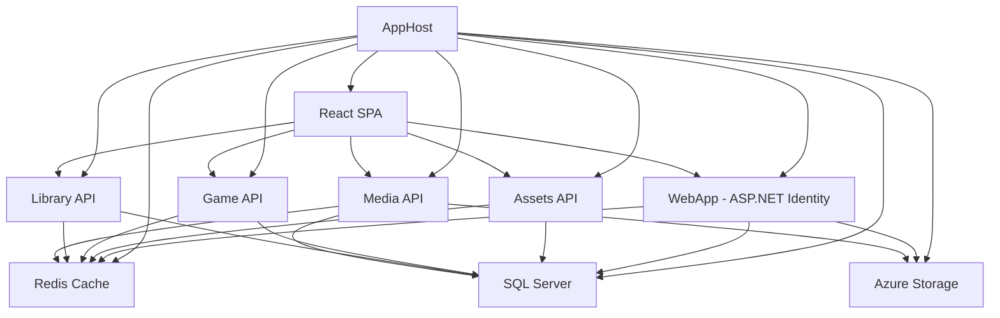

# VTTTools Complete React Migration Implementation Roadmap

## Project Overview

### Migration Summary
**VTTTools** is migrating from a hybrid Blazor architecture (Server-side + WebAssembly Components) to a complete **React 18+ application** with **TypeScript**, **Konva.js**, and **Material UI**. This comprehensive roadmap orchestrates the implementation of all **58 user stories** across **6 strategic phases** over **20-24 weeks** (4-6 months).

**Current Architecture:** .NET 9.0 + Aspire + Blazor Server + WebAssembly + TypeScript
**Target Architecture:** React 18+ + TypeScript + Konva.js + Material UI + **Existing .NET Aspire Microservices Infrastructure**

### Critical Integration Context
**This is NOT a standalone React project.** The React SPA integrates with the existing .NET Aspire solution:
- **Existing Infrastructure**: AppHost orchestrates Assets, Game, Library, Media, Auth microservices
- **Existing Authentication**: Dedicated VttTools.Auth microservice with ASP.NET Core Identity
- **Existing Database**: SQL Server, Redis, Azure Blob Storage fully operational
- **Existing APIs**: All CRUD operations and business logic implemented in microservices

### Key Deliverables
- ✅ **Complete UI Consistency**: Single React technology stack replacing hybrid Blazor
- ✅ **Enhanced Performance**: Konva.js canvas rendering with 50+ fps for 100+ assets
- ✅ **Modern Web Capabilities**: Advanced canvas manipulation, real-time collaboration
- ✅ **Professional VTT Interface**: Studio Professional design system optimized for content creators
- ✅ **Desktop-Focused Experience**: Optimized for 1280px+ creative workflows
- ✅ **Seamless Backend Integration**: Consumes existing microservices with zero backend changes

### Success Criteria
- **Performance Targets**: < 3s initial load, 50+ fps canvas rendering, < 2s API responses
- **User Experience**: Professional creative tool interface similar to Figma/Canva
- **Feature Completeness**: All 58 user stories implemented and tested
- **Quality Standards**: WCAG 2.1 AA accessibility compliance, < 5 critical bugs
- **Timeline**: 20-24 weeks with monthly milestone reviews
- **Integration Success**: Seamless communication with existing .NET Aspire infrastructure

### Resource Requirements
- **Core Team**: 4 developers (Frontend Architect, Canvas Specialist, Full-stack Developer, UI/UX Developer)
- **Supporting Roles**: QA Engineer, DevOps Engineer, Product Owner
- **Critical Skills**: React 18+, TypeScript, Konva.js performance optimization, Material UI, Redux Toolkit, **.NET Aspire integration**

---

## Phase Breakdown Strategy

### Phase 1: .NET Aspire Integration & Authentication Foundation
**Duration:** 5-6 weeks | **Risk Level:** Medium-High | **Team Focus:** Frontend Architect + Full-stack Developer

**Objective:** Integrate React SPA with existing .NET Aspire solution and authentication system
**Dependencies:** None (foundation phase)
**Parallel Development:** Error handling framework implemented alongside features

**CRITICAL INTEGRATION TASKS:**
- **Week 1**: VttTools.WebClientApp creation using npm + dotnet CLI integration with existing Aspire infrastructure
- **npm Commands**: Create React project with Vite template, install Material UI + Konva.js + testing dependencies
- **dotnet Commands**: Create .csproj wrapper, add to solution, configure project references
- **AppHost Registration**: Register React SPA in existing AppHost Program.cs with service dependencies
- **Service Discovery**: Vite proxy configuration for existing microservices (Assets, Game, Library, Media, Auth)
- **Project Replacement**: React app replaces WebApp and WebApp.WebAssembly projects
- **Development Validation**: `dotnet run --project Source/AppHost` starts entire solution including React with hot reload
- **Integration Testing**: Verify React can communicate with existing microservice endpoints (Assets, Game, Library, Media, Auth)
- **Authentication Planning**: Define authentication strategy since WebApp project will be replaced

**User Stories Implemented:**
- **US001**: Landing page explaining VTT platform with registration/login guidance
- **US003-US008**: Complete authentication system (**using VttTools.Auth microservice**)
- **US009-US011**: Profile and account management (**via Auth microservice endpoints**)
- **US032-US036**: Core error handling framework (network, validation, asset loading, scene save/load, system errors)

**Integration-Specific Deliverables:**
- React SPA registered in AppHost with service dependencies
- CORS policies configured in existing WebApp
- Service discovery via Vite proxy to existing microservices
- Authentication integration with existing ASP.NET Core Identity
- API clients configured to consume existing Domain layer contracts

### Phase 2: Core Navigation & Dashboard
**Duration:** 3 weeks | **Risk Level:** Low | **Team Focus:** UI/UX Developer + Frontend Architect

**Objective:** Implement authenticated user experience with navigation system using existing backend
**Dependencies:** Phase 1 Aspire integration completion
**Parallel Development:** Help system foundation with tooltips and contextual guidance

**User Stories Implemented:**
- **US002**: Dashboard with navigation to all features and recent activity display (**consuming existing APIs**)
- **US041-US043**: Help system (contextual help, search documentation, tooltips, quick guidance)

**Backend Integration:**
- Dashboard data sourced from existing Library and Game microservices
- User activity tracking via existing WebApp endpoints
- Navigation permissions based on existing Identity roles

### Phase 3: Content Management System
**Duration:** 4-5 weeks | **Risk Level:** Low-Medium | **Team Focus:** Full-stack Developer + UI/UX Developer

**Objective:** Complete adventure and asset management using existing backend microservices
**Dependencies:** Phase 2 navigation system
**Parallel Development:** Content organization features can be implemented after basic CRUD

**User Stories Implemented:**
- **US012-US016**: Adventure Management (**via existing Library microservice APIs**)
- **US017-US025**: Asset Management (**via existing Assets microservice APIs**)
- **US037-US040**: Content Organization (**using existing search/filter endpoints**)
- **US045**: Undo/Redo in content creation

**Backend Integration:**
- All CRUD operations consume existing Library microservice endpoints
- Asset management uses existing Assets microservice with Media service integration
- File uploads handled by existing Media microservice infrastructure
- Search and filtering leverage existing database queries and indexing

### Phase 4: Game Sessions & Real-time Communication
**Duration:** 4 weeks | **Risk Level:** Medium | **Team Focus:** Full-stack Developer + Frontend Architect

**Objective:** Game session management with real-time chat using existing Game microservice
**Dependencies:** Phase 3 content management (sessions need adventures/assets)
**Technical Risk:** SignalR integration with existing Game microservice

**User Stories Implemented:**
- **US026-US029**: Game Session Management (**via existing Game microservice APIs**)
- **US030**: Real-time chat (**through existing SignalR hubs in Game microservice**)

**Backend Integration:**
- Session management consumes existing Game microservice endpoints
- Real-time chat connects to existing SignalR hubs
- Player management uses existing Identity integration
- Session state synchronized via existing Redis infrastructure

### Phase 5: Scene Builder Canvas System ⚠️ **HIGHEST RISK PHASE**
**Duration:** 6-8 weeks | **Risk Level:** High | **Team Focus:** Canvas Specialist + Frontend Architect

**Objective:** Multi-layer Konva.js canvas with advanced asset manipulation using existing backend
**Dependencies:** Phase 3 asset management (Scene Builder requires asset library)
**Performance Critical:** 50+ fps with 100+ assets, complex canvas interactions

**User Stories Implemented:**
- **US047**: Canvas Foundation (multi-layer Konva.js with high-performance rendering)
- **US048**: Background Image Management (**using existing Media microservice**)
- **US049**: Grid System Configuration (square, hex, isometric grid systems)
- **US050**: Asset Library Browsing (**consuming existing Assets microservice**)
- **US051**: Basic Asset Placement (drag-and-drop asset positioning)
- **US052**: Advanced Asset Manipulation (rotation, scaling, locking functionality)
- **US053**: Layer Management (visibility and ordering controls)
- **US054**: Zoom Pan Controls (efficient navigation of large battle maps)
- **US055**: Grid Snapping (precise alignment with grid systems)
- **US056**: Scene State Persistence (**via existing Library microservice Scene endpoints**)
- **US044**: Undo/Redo in Scene Builder (experiment freely and recover from mistakes)

**Backend Integration:**
- Scene persistence uses existing Library microservice Scene APIs
- Asset loading from existing Assets microservice with Media service integration
- Background images handled by existing Media microservice
- Scene state serialization matches existing C# Domain models

### Phase 6: Integration, Performance & Polish
**Duration:** 3-4 weeks | **Risk Level:** Medium | **Team Focus:** Full Team

**Objective:** Final integration, performance optimization, and production readiness
**Dependencies:** All previous phases completed
**Focus Areas:** Cross-feature integration, performance tuning, accessibility compliance

**User Stories Implemented:**
- **US046**: Data Recovery for Accidental Changes (**using existing audit/versioning systems**)
- Performance optimization and integration testing
- Accessibility improvements and final UI polish
- Cross-feature integration validation

**Aspire Integration:**
- Production deployment configuration within Aspire orchestration
- Performance monitoring integrated with existing infrastructure
- Health checks aligned with Aspire service monitoring

---

## .NET Aspire Integration Architecture

### Service Dependencies
The React SPA integrates with the existing .NET Aspire infrastructure:



### AppHost Registration Pattern
```csharp
// In Source/AppHost/Program.cs - ADD after existing services
var reactSpa = builder.AddNpmApp("react-spa", "../Documents/Tasks/VTTTools_Frontend_Migration/react-spa")
                     .WithReference(cache)
                     .WithReference(database)
                     .WithReference(blobs)
                     .WithReference(resources).WaitFor(resources)
                     .WithReference(assets).WaitFor(assets)
                     .WithReference(library).WaitFor(library)
                     .WithReference(game).WaitFor(game)
                     .WithReference(webApp).WaitFor(webApp)
                     .WithHttpHealthCheck("health")
                     .WithEndpoint("https", endpoint => endpoint.IsProxied = !isDevelopment);
```

### Development Workflow Integration
**Primary Development Command:**
```bash
dotnet run --project Source/AppHost
```

**Available Services After Startup:**
- React SPA: https://localhost:5173 (or assigned port)
- Assets API: https://localhost:[port]
- Game API: https://localhost:[port]
- Library API: https://localhost:[port]
- Media API: https://localhost:[port]
- WebApp Identity: https://localhost:[port]
- Aspire Dashboard: https://localhost:17086

**Service Discovery Configuration:**
```typescript
// vite.config.ts
export default defineConfig({
  server: {
    proxy: {
      '/api/auth': 'https+http://auth-api',         // Auth microservice
      '/api/assets': 'https+http://assets-api',     // Assets microservice
      '/api/adventures': 'https+http://library-api', // Library microservice
      '/api/scenes': 'https+http://library-api',    // Scene endpoints
      '/api/sessions': 'https+http://game-api',     // Game sessions
      '/api/media': 'https+http://resources-api',   // Media resources
      '/signalr': {
        target: 'https+http://game-api',
        ws: true,
        changeOrigin: true
      },
    },
  },
});
```

---

## Use Case Implementation Sequence

### Authentication Foundation (Phase 1)
```
UC003 → UC004 → UC005 → UC006 → UC007 → UC008 → UC009 → UC010 → UC011
```
**Integration Dependencies:** Existing WebApp Identity system must be accessible via CORS
**Backend Integration:** Authentication flows through existing ASP.NET Core Identity endpoints

### Navigation & Dashboard (Phase 2)
```
UC001 → UC002 → UC041 → UC042 → UC043
```
**Dependencies:** React SPA integration with Aspire service discovery complete
**Backend Integration:** Dashboard consumes existing microservice APIs for user activity

### Content Management (Phase 3)
```
UC012 → UC013 → UC014 → UC015 → UC016 → UC017 → UC018 → UC019 → UC020 → UC021 → UC022 → UC023 → UC024 → UC025 → UC037 → UC038 → UC039 → UC040 → UC045
```
**Dependencies:** Service discovery for Library and Assets microservices
**Backend Integration:** All CRUD operations use existing microservice endpoints

### Sessions & Communication (Phase 4)
```
UC026 → UC027 → UC028 → UC029 → UC030
```
**Dependencies:** Library microservice integration (sessions reference adventures)
**Backend Integration:** Game microservice APIs and existing SignalR hubs

### Scene Builder Canvas (Phase 5) ⚠️
```
UC047 → UC048 → UC049 → UC050 → UC051 → UC052 → UC053 → UC054 → UC055 → UC056 → UC044
```
**Critical Dependencies:**
- UC047 (Canvas Foundation) must integrate with existing Scene API contracts
- UC048 (Background Images) must use existing Media microservice endpoints
- UC050 (Asset Library) must consume existing Assets microservice APIs
- UC056 (Scene Persistence) must serialize to existing C# Domain models

### Final Integration (Phase 6)
```
UC046 → Performance Optimization → Integration Testing → Accessibility → Production Readiness
```
**Backend Integration:** Data recovery uses existing audit trails and versioning systems

---

## Dependencies Matrix

### Technical Dependencies
| Feature Group | Depends On | Backend Integration |
|---------------|------------|-------------------|
| Dashboard (UC002) | Aspire Integration + Authentication | Auth microservice + Library/Game APIs |
| Content Management (UC012-UC025) | Dashboard + Service Discovery | Library + Assets + Media microservices |
| Sessions (UC026-UC030) | Content Management | Game microservice + existing SignalR |
| Scene Builder (UC047-UC056) | Asset Management + Canvas Foundation | Library Scenes API + Assets API |
| Advanced Canvas (UC048-UC056) | Canvas Foundation + Media Integration | Media microservice + Scene persistence |

### Service Integration Dependencies
| React Feature | Existing Microservice | API Endpoints |
|---------------|---------------------|---------------|
| Adventure Management | Library API | /api/adventures/* |
| Asset Management | Assets API | /api/assets/* |
| Scene Builder | Library API | /api/adventures/{id}/scenes/* |
| Game Sessions | Game API | /api/sessions/* |
| Real-time Chat | Game API | /signalr/gamehub |
| Media Upload | Media API | /api/media/* |
| Authentication | Auth API | /api/auth/* |

### Data Integration Dependencies
| Frontend State | Backend Source | Integration Method |
|---------------|----------------|-------------------|
| User Authentication | Auth microservice | Cookie-based auth |
| Adventure Data | Library microservice | REST API + RTK Query |
| Asset Library | Assets microservice | REST API + RTK Query |
| Scene State | Library Scene APIs | REST API + Domain contracts |
| Game Sessions | Game microservice | REST API + SignalR |
| Media Resources | Media microservice | REST API + Blob storage |

---

## Milestone Deliverables

### Phase 1 Deliverables ✅ **CRITICAL INTEGRATION MILESTONE**
**Demo-able Functionality:**
- React SPA running within .NET Aspire orchestration environment
- Complete authentication flow using existing ASP.NET Core Identity system
- Landing page with VTT platform explanation integrated with existing branding
- Password reset functionality via existing email infrastructure
- Two-factor authentication using existing Identity configuration
- External login providers (Google, Microsoft, GitHub) via existing setup
- User profile management consuming existing Identity endpoints
- Comprehensive error handling with user-friendly messages

**Technical Integration Deliverables:**
- **AppHost Registration**: React SPA registered in existing AppHost with proper dependencies
- **Service Discovery**: Vite proxy configuration routing to existing microservices
- **CORS Configuration**: WebApp configured to accept React SPA requests
- **Authentication Integration**: Cookie-based auth with existing Identity system
- **API Client Setup**: RTK Query configured for existing microservice endpoints
- **Development Workflow**: Single command (`dotnet run --project Source/AppHost`) starts entire solution

### Phase 2 Deliverables ✅
**Demo-able Functionality:**
- Authenticated dashboard consuming existing user activity data from microservices
- Navigation system with role-based menu items from existing Identity roles
- Help system with contextual tooltips and searchable documentation
- Responsive design working across desktop screen sizes
- User status indicators using existing session management

**Technical Integration Deliverables:**
- **API Integration**: Dashboard consuming Library and Game microservice APIs
- **State Management**: Redux state synchronized with existing backend data
- **Component Library**: Material UI integrated with existing design system
- **Service Communication**: Reliable communication with all existing microservices

### Phase 3 Deliverables ✅
**Demo-able Functionality:**
- Adventure CRUD operations using existing Library microservice endpoints
- Adventure cloning consuming existing template functionality
- Adventure visibility controls integrated with existing permission system
- Complete asset library consuming existing Assets microservice data
- Asset image upload using existing Media microservice infrastructure
- Search and filter functionality leveraging existing database queries
- Content organization using existing folder and tag systems
- Undo/Redo functionality for content operations

**Technical Integration Deliverables:**
- **Library API Integration**: Complete CRUD operations via existing endpoints
- **Assets API Integration**: Asset management using existing microservice
- **Media API Integration**: File upload via existing infrastructure
- **Data Synchronization**: Frontend state synchronized with backend data
- **Performance Optimization**: Efficient data loading from existing APIs

### Phase 4 Deliverables ✅
**Demo-able Functionality:**
- Game session management using existing Game microservice APIs
- Session scheduling integrated with existing calendar functionality
- Player invitation system using existing notification infrastructure
- Real-time chat connected to existing SignalR hubs in Game microservice
- Session participant management with existing role systems

**Technical Integration Deliverables:**
- **Game API Integration**: Session management via existing endpoints
- **SignalR Integration**: Real-time communication through existing hubs
- **Redis Integration**: Session state using existing cache infrastructure
- **Identity Integration**: Player management via existing user system

### Phase 5 Deliverables ✅ **CRITICAL PERFORMANCE MILESTONE**
**Demo-able Functionality:**
- Multi-layer Konva.js canvas with smooth 50+ fps performance
- Background image management using existing Media microservice
- Grid system selection integrated with existing Scene configuration
- Asset library integration consuming existing Assets microservice data
- Drag-and-drop asset placement with collision detection
- Asset manipulation tools (rotate, scale, lock/unlock, position)
- Layer management with visibility toggles and reordering
- Zoom and pan controls with smooth performance
- Grid snapping functionality with configurable parameters
- Scene state persistence via existing Library microservice Scene APIs
- Comprehensive undo/redo system for all Scene Builder operations

**Technical Integration Deliverables:**
- **Scene API Integration**: Scene persistence using existing Library endpoints
- **Assets API Integration**: Asset loading from existing microservice
- **Media API Integration**: Background images via existing infrastructure
- **Domain Model Compatibility**: Scene serialization matching existing C# models
- **Performance Targets Met**: 50+ fps with 100+ assets using existing data

### Phase 6 Deliverables ✅
**Demo-able Functionality:**
- Data recovery system using existing audit trail and versioning systems
- Optimized performance meeting all targets with existing backend
- Cross-feature integration across all existing microservices
- Accessibility compliance with screen reader support
- Final UI polish consistent with existing design system

**Technical Integration Deliverables:**
- **Production Configuration**: Aspire deployment with React SPA integration
- **Monitoring Integration**: Performance monitoring via existing infrastructure
- **Health Checks**: React SPA health integrated with Aspire service monitoring
- **Documentation**: Complete integration documentation for existing architecture

---

## Implementation Timeline

### Detailed 24-Week Schedule

#### Phase 1: .NET Aspire Integration & Authentication Foundation (Weeks 1-6)

**Week 1: VttTools.WebClientApp Creation and Aspire Integration**

**Tool Usage Sequence**:
```bash
# Step 1: Create React project with npm
cd Source
npm create vite@latest WebClientApp -- --template react-ts
cd WebClientApp
npm install

# Step 2: Install dependencies
npm install @mui/material @emotion/react @emotion/styled @mui/icons-material
npm install konva react-konva @types/konva
npm install @reduxjs/toolkit react-redux axios @microsoft/signalr
npm install --save-dev @testing-library/react @playwright/test

# Step 3: Create .csproj file (manual)
# Create VttTools.WebClientApp.esproj with project references

# Step 4: Add to .NET solution
cd ..
dotnet sln VttTools.sln add WebClientApp\VttTools.WebClientApp.esproj --solution-folder "3 WebApp"
```

**Integration Tasks**:
- **CRITICAL**: AppHost registration in Source\AppHost\Program.cs for React SPA
- **CRITICAL**: Vite proxy setup for service discovery to existing microservices (Assets, Game, Library, Media, Auth)
- **CRITICAL**: Development environment validation: `dotnet run --project Source/AppHost` includes React
- **CRITICAL**: Authentication integration with VttTools.Auth microservice (WebApp UI replaced)
- Project reference validation: Access to WebApp.Common and Domain contracts

**Week 2: Authentication Integration**
- React SPA authentication integration with VttTools.Auth microservice
- Landing page implementation consuming existing branding and configuration
- Cookie-based authentication flow using Auth microservice endpoints
- User registration integration with Auth microservice validation and email systems

**Week 3: Advanced Authentication Features**
- Password reset functionality via existing email infrastructure and token handling
- Two-factor authentication integration with existing Identity 2FA configuration
- External login providers using existing OAuth configurations (Google, Microsoft, GitHub)
- Authentication state management with Redux Toolkit consuming existing endpoints

**Week 4: Profile Management & API Client Setup**
- User profile management consuming existing Identity user endpoints
- Account settings integration with existing privacy and security controls
- RTK Query API client configuration for all existing microservices
- API contract integration using existing Domain layer type definitions

**Week 5: Error Handling & Service Integration**
- Comprehensive error handling framework for microservice communication
- Service discovery validation and error recovery for all existing APIs
- Form validation integration matching existing backend validation rules
- Network error handling with retry logic for microservice calls

**Week 6: Integration Testing & Refinement**
- End-to-end authentication flow testing with existing backend
- Service discovery robustness testing with all microservices
- Performance testing of React SPA within Aspire orchestration
- Integration documentation and developer workflow validation

**Quality Gate:** Complete React SPA integration with .NET Aspire solution and functional authentication

#### Phase 2: Core Navigation & Dashboard (Weeks 7-9)

**Week 7: Dashboard & Microservice Integration**
- Authenticated dashboard consuming user activity data from Library and Game microservices
- Recent activity display using existing audit logs and activity tracking
- Navigation system with role-based menu structure from existing Identity roles
- Responsive layout with Material UI integrated with existing design tokens

**Week 8: Help System & User Experience**
- Help system infrastructure consuming existing documentation and help content
- Contextual tooltips integrated with existing feature documentation
- Searchable help content using existing search infrastructure
- User onboarding flow leveraging existing welcome and tutorial systems

**Week 9: Component Library & Service Communication**
- Material UI component library integration with existing design system
- Consistent styling and theming aligned with existing brand guidelines
- Component testing with mocked microservice responses
- Service communication reliability testing and error boundary implementation

**Quality Gate:** Complete navigation system integrated with existing backend services

#### Phase 3: Content Management System (Weeks 10-14)

**Week 10: Adventure Management Integration**
- Adventure CRUD operations consuming existing Library microservice endpoints
- Adventure list and detail views using existing data models and validation
- Adventure categorization using existing type systems and metadata
- Form integration with existing CreateAdventureRequest and UpdateAdventureRequest contracts

**Week 11: Advanced Adventure Features**
- Adventure cloning functionality using existing template and duplication systems
- Adventure visibility controls integrated with existing permission and sharing systems
- Adventure metadata management using existing tag and category infrastructure
- Bulk operations leveraging existing batch processing capabilities

**Week 12: Asset Management Integration**
- Asset library consuming existing Assets microservice with complete CRUD operations
- Asset categorization using existing AssetType enums and classification systems
- Asset image upload integration with existing Media microservice infrastructure
- Asset thumbnail generation using existing image processing pipeline

**Week 13: Content Organization & Search**
- Search and filter functionality leveraging existing database queries and indexing
- Advanced filtering using existing metadata and tag systems
- Content organization using existing folder structure and hierarchy systems
- Performance optimization for large content libraries via existing pagination

**Week 14: Content Management Polish & Undo System**
- Bulk content operations using existing batch processing APIs
- Undo/Redo functionality with state management for content operations
- Content validation and error recovery using existing business rules
- Integration testing with large datasets from existing production data

**Quality Gate:** Complete content management system integrated with existing microservices

#### Phase 4: Game Sessions & Real-time Communication (Weeks 15-18)

**Week 15: Game Session Integration**
- Session management consuming existing Game microservice APIs
- Session CRUD operations using existing CreateGameSessionRequest and UpdateGameSessionRequest contracts
- Session scheduling integration with existing calendar and notification systems
- Session status management using existing GameSessionStatus workflow

**Week 16: Player Management & Invitations**
- Player invitation system using existing notification and email infrastructure
- RSVP functionality integrated with existing user management and response tracking
- Session participant management leveraging existing Identity and role systems
- Player status indicators using existing presence and activity tracking

**Week 17: SignalR Integration & Real-time Infrastructure**
- SignalR client integration with existing Game microservice hubs
- Real-time connection management using existing connection handling and recovery
- Message queue integration with existing reliable delivery systems
- Connection state synchronization with existing session management

**Week 18: Real-time Chat System**
- Real-time chat implementation using existing SignalR hubs and message infrastructure
- Message history integration with existing chat storage and retrieval systems
- Message types and moderation using existing chat rules and filtering
- Performance testing with existing load balancing and scaling infrastructure

**Quality Gate:** Complete session management with real-time communication via existing infrastructure

#### Phase 5: Scene Builder Canvas System (Weeks 19-24) ⚠️ **CRITICAL INTEGRATION PHASE**

**Week 19: Canvas Foundation & Scene API Integration**
- Konva.js multi-layer canvas setup with performance optimization
- Scene data model integration with existing Library microservice Scene APIs
- Canvas state synchronization with existing Scene persistence systems
- Performance monitoring targeting 50+ fps with existing backend data

**Week 20: Asset Integration & Background Management**
- Asset library integration consuming existing Assets microservice for canvas placement
- Background image management using existing Media microservice infrastructure
- Image loading optimization leveraging existing CDN and caching systems
- Asset caching strategy using existing browser and Redis cache infrastructure

**Week 21: Grid Systems & Advanced Interactions**
- Grid system implementation using existing Scene configuration and GridType enums
- Grid configuration integration with existing Scene settings and preferences
- Enhanced interactions with existing coordinate systems and positioning logic
- Canvas performance optimization with existing asset loading and caching

**Week 22: Asset Manipulation & Layer Management**
- Asset transformation using existing coordinate and scaling systems
- Multi-select functionality with existing selection and grouping logic
- Layer management integration with existing Scene layer hierarchy and ordering
- Asset property synchronization with existing SceneAsset data models

**Week 23: Scene Persistence & Undo System**
- Scene state serialization compatible with existing C# Domain models
- Save/Load functionality using existing Library microservice Scene endpoints
- Auto-save integration with existing backup and recovery systems
- Comprehensive undo/redo system maintaining compatibility with existing audit trails

**Week 24: Canvas Performance & Integration Testing**
- Performance optimization achieving 50+ fps target with existing backend data
- Memory management and leak prevention with existing asset loading patterns
- End-to-end testing with realistic datasets from existing production systems
- Integration validation across all existing microservices and infrastructure

**Quality Gate:** Complete Scene Builder integrated with existing infrastructure meeting performance targets

#### Phase 6: Integration, Performance & Polish (Weeks 25-26)

**Week 25: Performance Optimization & Cross-Integration**
- Application-wide performance optimization leveraging existing infrastructure capabilities
- Bundle optimization and code splitting for production deployment within Aspire
- Cross-feature integration testing ensuring seamless workflows with existing backend
- Memory and performance monitoring integrated with existing observability systems

**Week 26: Final Polish & Production Readiness**
- Data recovery system integration with existing audit trail and versioning infrastructure
- Accessibility compliance testing and fixes maintaining consistency with existing standards
- Production deployment configuration within existing Aspire orchestration
- Final documentation and handover including integration patterns and troubleshooting guides

**Quality Gate:** Production-ready React SPA fully integrated with existing .NET Aspire infrastructure

### Quality Gates & Integration Checkpoints

**Monthly Milestone Reviews:**
- **End of Week 6**: React SPA successfully integrated with .NET Aspire solution
- **End of Week 9**: Dashboard and navigation consuming existing microservice APIs
- **End of Week 14**: Content management integrated with Library and Assets microservices
- **End of Week 18**: Real-time communication working via existing Game microservice
- **End of Week 22**: Scene Builder consuming existing APIs and meeting performance targets
- **End of Week 26**: Production-ready application fully integrated with existing infrastructure

**Integration Performance Checkpoints:**
- **Week 6**: Service discovery latency < 50ms to existing microservices
- **Week 14**: Content loading < 2s from existing APIs
- **Week 18**: Real-time message delivery < 100ms via existing SignalR
- **Week 22**: Canvas 50+ fps with existing asset data
- **Week 26**: Overall application performance targets met with existing infrastructure

---

## Risk Management

### High-Risk Areas & Mitigation Strategies

#### .NET Aspire Integration Complexity (Phase 1) ⚠️ **NEW HIGH RISK**

**Primary Risks:**
- **Service Discovery Risk**: Vite proxy configuration may have issues routing to Aspire-managed microservices
- **CORS Complexity**: Existing WebApp CORS policies may conflict with React SPA requirements
- **Authentication Integration**: Cookie-based auth flow may have compatibility issues with SPA architecture
- **Development Workflow**: Aspire orchestration complexity may impact development velocity

**Mitigation Strategies:**
- **Early Integration Testing**: Week 1 focus on basic connectivity to all existing microservices
- **Service Discovery Validation**: Comprehensive testing of Aspire service name resolution
- **Authentication Flow Testing**: Early validation of cookie-based auth with SPA routing
- **Fallback Strategies**: Direct service URL configuration if service discovery fails
- **Documentation**: Comprehensive integration patterns documentation for team reference

**Risk Indicators:**
- Service discovery resolution failures > 5%
- Authentication flow requiring page refresh
- CORS errors preventing API communication
- Development environment startup time > 5 minutes

#### Scene Builder Canvas System (Phase 5) ⚠️ **HIGHEST TECHNICAL RISK**

**Primary Risks:**
- **Performance Risk**: Konva.js canvas with existing backend data may not achieve 50+ fps target
- **Backend Integration Risk**: Scene serialization may not match existing C# Domain models exactly
- **Asset Loading Risk**: Large asset datasets from existing microservices may impact performance

**Mitigation Strategies:**
- **Backend Data Compatibility**: Early validation of Scene API contracts and data serialization
- **Performance Testing**: Continuous monitoring with realistic datasets from existing production data
- **Asset Loading Optimization**: Leverage existing Media microservice caching and CDN capabilities
- **Incremental Implementation**: Build canvas with progressively larger datasets
- **Fallback Performance**: Accept 40 fps if 50+ fps cannot be achieved with existing data volumes

**Risk Indicators:**
- Scene loading from existing APIs > 3 seconds
- Canvas FPS dropping below 40 with existing asset counts
- Scene save/load compatibility issues with existing backend

#### Authentication & CORS Integration (Phase 1) - **MEDIUM RISK**

**Primary Risks:**
- **Cookie Security**: SameSite cookie policies may prevent authentication with SPA
- **CORS Configuration**: Complex CORS requirements for multiple development URLs
- **Identity Integration**: Existing Identity configuration may not support SPA patterns

**Mitigation Strategies:**
- **Authentication Testing**: Comprehensive testing of existing Identity endpoints from React
- **CORS Policy Refinement**: Iterative CORS configuration testing with development and production URLs
- **Identity Consultation**: Leverage existing WebApp Identity expertise for integration patterns
- **Alternative Auth**: Token-based auth fallback if cookie-based auth fails

**Risk Indicators:**
- Authentication requiring page refresh or redirect loops
- API calls failing with CORS errors after authentication
- Session timeout issues with existing Identity configuration

### Timeline Risk Management

**Integration Buffer Allocation:**
- **Phase 1 Extended**: 5-6 weeks instead of 4 for integration complexity
- **Integration Testing**: Additional time allocated in each phase for backend integration validation
- **Cross-Service Testing**: Buffer time for testing interactions between React SPA and all existing microservices

**Scope Adjustment Strategies:**
1. **Backend Dependency Reduction**: Implement basic functionality first, advanced features later
2. **Performance Trade-offs**: Accept reduced performance targets if existing infrastructure limits performance
3. **Feature Prioritization**: Focus on core integration patterns, defer advanced UI features

**Critical Decision Points:**
- **Week 3**: Validate React + Aspire integration patterns work reliably
- **Week 6**: Confirm authentication integration meets security and usability requirements
- **Week 18**: Assess SignalR integration complexity and performance
- **Week 22**: Final validation that Scene Builder meets performance targets with existing data

---

## Success Criteria and Quality Gates

### Technical Success Criteria

**Integration Benchmarks:**
- **Service Discovery**: < 50ms resolution time to existing microservices
- **API Communication**: < 2s response time from existing microservice endpoints
- **Authentication**: Seamless SSO with existing Identity system, no page refresh required
- **Real-time Communication**: < 100ms message delivery via existing SignalR infrastructure
- **Data Synchronization**: < 1s sync time between React state and existing backend data

**Performance Benchmarks (with existing backend):**
- **Initial Load Time**: < 3 seconds to interactive (including existing API calls)
- **Route Navigation**: < 500ms between pages (including API data loading)
- **Canvas Rendering**: 50+ fps with existing asset datasets (up to 100 assets)
- **Content Loading**: < 2s to load adventures/assets from existing APIs
- **Scene Operations**: < 3s to save/load scenes via existing Library microservice

### Integration Success Criteria

**Microservice Integration:**
- All existing API endpoints accessible and functional from React SPA
- No changes required to existing microservice codebases
- Authentication seamlessly integrated with existing Identity system
- Real-time features working via existing SignalR infrastructure
- File uploads functional via existing Media microservice

**Development Workflow:**
- Single command starts entire solution: `dotnet run --project Source/AppHost`
- React SPA runs reliably within Aspire orchestration
- Service discovery automatically resolves existing microservice endpoints
- Development environment stable with all existing services

**Data Compatibility:**
- React state models match existing C# Domain models
- API requests/responses compatible with existing contracts
- Scene serialization compatible with existing backend storage
- User data consistency across existing Identity and new React interface

### Business Success Criteria

**Project Delivery:**
- **Timeline**: Completion within 24-26 weeks with integration complexity buffers
- **Integration**: Zero breaking changes to existing backend infrastructure
- **Quality**: Seamless user experience equivalent to existing Blazor application
- **Performance**: Improved user experience leveraging existing backend capabilities

**Technical Debt Management:**
- Frontend-backend integration patterns documented for future development
- Service discovery and CORS patterns established for additional frontend projects
- Performance optimization techniques validated with existing infrastructure
- Monitoring and deployment processes integrated with existing DevOps practices

### Quality Gates by Phase

#### Phase 1 Quality Gate ⚠️ **CRITICAL INTEGRATION MILESTONE**
- ✅ React SPA starts reliably within Aspire orchestration via single command
- ✅ Service discovery successfully resolves all existing microservice endpoints
- ✅ Authentication flows seamlessly through VttTools.Auth microservice
- ✅ CORS policies configured correctly for all existing microservice communications
- ✅ API clients successfully communicate with all existing microservices
- ✅ Development workflow established and documented for team adoption

#### Phase 2 Quality Gate
- ✅ Dashboard displays data from existing Library and Game microservices
- ✅ Navigation system integrates with existing Identity roles and permissions
- ✅ Help system consumes existing documentation and help content
- ✅ Material UI theming consistent with existing design system
- ✅ Component library established for consistent development patterns

#### Phase 3 Quality Gate
- ✅ Adventure management fully functional via existing Library microservice APIs
- ✅ Asset management integrated with existing Assets and Media microservices
- ✅ Search and filtering leverages existing database queries and indexing
- ✅ File upload system works via existing Media microservice infrastructure
- ✅ Content organization uses existing folder and tag systems

#### Phase 4 Quality Gate
- ✅ Game session management functional via existing Game microservice APIs
- ✅ Real-time chat working through existing SignalR hubs with < 100ms latency
- ✅ Player management integrated with existing Identity and notification systems
- ✅ Session persistence uses existing Redis cache infrastructure
- ✅ Notification system leverages existing email and alert infrastructure

#### Phase 5 Quality Gate ⚠️ **CRITICAL PERFORMANCE MILESTONE**
- ✅ Canvas maintains 50+ fps with realistic datasets from existing microservices
- ✅ Scene persistence fully compatible with existing Library microservice Scene APIs
- ✅ Asset loading optimized using existing Media microservice and caching
- ✅ Background images managed via existing Media microservice infrastructure
- ✅ Scene serialization matches existing C# Domain models exactly
- ✅ Undo/Redo system maintains compatibility with existing audit systems

#### Phase 6 Quality Gate
- ✅ Cross-microservice integration tests pass with no critical failures
- ✅ Performance targets met consistently with existing backend load
- ✅ Data recovery integrated with existing backup and audit systems
- ✅ Production deployment configuration within existing Aspire orchestration
- ✅ Monitoring integrated with existing observability and alerting systems

### Testing Strategy for Integration

**Integration Testing:**
- API integration testing with all existing microservices using real endpoints
- Authentication flow testing with existing Identity system and CORS policies
- Service discovery testing with Aspire orchestration and proxy configuration
- Real-time communication testing with existing SignalR hubs and Redis infrastructure

**Performance Testing:**
- Load testing with realistic datasets from existing production databases
- Canvas performance testing with actual asset counts from existing Asset microservice
- API response time testing under realistic load with existing backend infrastructure
- End-to-end workflow testing simulating realistic user patterns with existing data

**Compatibility Testing:**
- Data model compatibility testing between React state and existing C# Domain models
- API contract testing ensuring requests/responses match existing microservice expectations
- Authentication compatibility testing across different browsers with existing Identity cookies
- Cross-browser compatibility testing with existing CORS and security policies

---

This updated roadmap correctly positions the React migration as a frontend integration project with the existing .NET Aspire infrastructure, emphasizing reuse of existing backend services and proper integration patterns rather than standalone development.